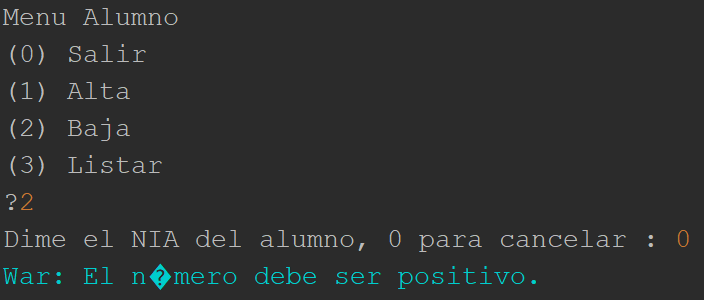

## Errores


## TODO
- [x] Insertar Alumno
- [x] Eliminar Alumno
  - [x] Matricular Alumno
    - [x] Encontrar Alumno
    - [x] Encontrar Modulo (por nombre)
      - [x] Hacer que no pueden haver varios modulos con el mismo nombre
  - [x] Eliminar Matricula
- [x] Insertar Modulo
- [x] Eliminar Modulo
  - [x] Eliminar Matriculas con el Modulo
- [x] Añadir notas a Aluumno en un modulo
  - [x] Matricular Alumno
  - [x] Insertar Modulo
- [x] Modificar Notas
- [x] Añadir notas
- [x] PedirID Matrcula
- [ ] Importar DB
- [x] Exportar DB
- [ ] Crear tablas si no las encuentra
  - [x] crear funcion para crear las tablas
- [ ] Ordenar codigo
  - [ ] gestionar private, public, protected
  - [ ] Mensajes de error
- [ ] Clase menu


```java
//***********
    //   ORM
    //***********
    public double[] getNotasList() {
        double[] notasList = null;
        if (notas != null) {
            String[] partes = notas.split("#");
            notasList = new double[partes.length];
            for (int i = 0; i < partes.length; i++) {
                notasList[i] = Double.parseDouble(partes[i]);
            }
        }
        return notasList;
    }

    public void setNotasList(double[] notasList) {
        String cadena = String.join("#", Arrays.stream(notasList)
                .mapToObj(String::valueOf)
                .toArray(String[]::new));
        this.notas = cadena;
    }

    public void addNota(double... notas) {
        double[] lastNotas = getNotasList();
        double[] newNotas;
        int lastNotasSize = 0;
        if (lastNotas != null) {
            lastNotasSize = lastNotas.length;
            newNotas = new double[lastNotas.length + notas.length];
            for (int i = 0; i < lastNotas.length; i++) {
                newNotas[i] = lastNotas[i];
            }
        } else {
            newNotas = new double[notas.length];
        }
        for (int i = lastNotasSize; i < newNotas.length; i++) {
            newNotas[i] = notas[i - lastNotasSize];
        }
        setNotasList(newNotas);
    }

    public void mostrarNotas() {
        double[] notasList = getNotasList();
        if (notasList == null) {
            Colors.warMsg(this.alumno.getNombre() + " no tiene notas en " + this.modulo.getNombre());
        } else {

            System.out.println("Notas de " + this.alumno.getNombre() + " en " + this.modulo.getNombre() + ": ");
            for (int i = 0; i < notasList.length; i++) {
                System.out.println(i + 1 + ".- " + notasList[i]);
            }
        }
    }
    //***********
    //   /ORM
    //***********
```