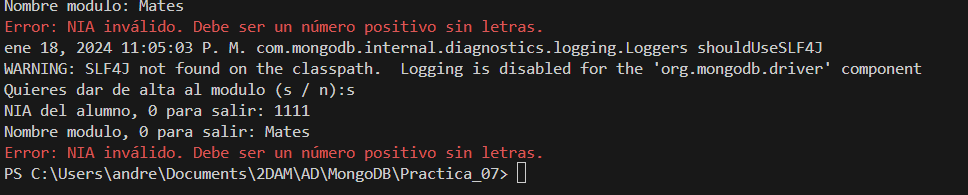

# Memoria Practica VII BBDD Objecte-Relacionals
## Que 

Modifica el programa anterior para que puga almacenar l'informació a alguna Base de Dades orientada a Objectes o noSQL. El nuevo programa he de implementar CRUD para todas las entidades

## Para que
Este ejercicio ha resultado útil para aprender y practicar el funcionamiento de los conectores con bases de datos noSQL. También ha sido beneficioso para adquirir conocimientos sobre bases de datos de este tipo, ya que fue necesario informarme sobre como es su funcionamiento. En mi experiencia, la dificultad de este programa reside la gestión por software, además de nuevas implementaciones en el programa. En resumen, la actividad fue útil para comprender mejor el funcionamiento de conectores, así como para aprender y saber que existen bases de datos noSQL, entre otros aspectos.

## Diagrama

## Como
En primer lugar, empezaré hablando de mis clases generales:
### Paquete Utilidades
#### ReadClient
Mi clase ReadClient es una clase que sirve para leer el teclado del cliente y gestionar posibles errores. En el constructor de la clase, asigna a 'sc', de tipo Scanner, un objeto Scanner. En general, las funciones de esta clase siempre solicitan una cadena, que es el mensaje que le proporciona al usuario para saber qué tipo de dato debe introducir. Todas ellas gestionan sus propias excepciones.

- **pedirInt(String msg):** Solicita al usuario ingresar un número entero desde la consola, mostrando un mensaje previo. Se manejan excepciones para garantizar que el usuario ingrese un valor válido.
- **pedirDouble(String msg):** Solicita al usuario ingresar un número decimal desde la consola, mostrando un mensaje previo. Se manejan excepciones para garantizar que el usuario ingrese un valor válido.
- **pedirIntPositivo(String msg):** Solicita al usuario ingresar un número entero positivo desde la consola, mostrando un mensaje previo y validando que sea un número positivo.
- **pedirIntRango(String msg, int min, int max):** Solicita al usuario ingresar un número entero dentro de un rango específico desde la consola, mostrando un mensaje previo y validando que esté dentro del rango.
- **pedirDoublePositivo(String msg):** Solicita al usuario ingresar un número decimal positivo desde la consola, mostrando un mensaje previo y validando que sea un número positivo.
- **pedirDoubleRango(String msg, double min, double max):** Solicita al usuario ingresar un número decimal dentro de un rango específico desde la consola, mostrando un mensaje previo y validando que esté dentro del rango.
- **pedirString(String msg, boolean allowNull):** Solicita al usuario ingresar una cadena de texto desde la consola, mostrando un mensaje previo y validando si se permite una cadena nula o vacía.
- **pedirStringLow(String msg, boolean allowNull):** Solicita una cadena de texto al usuario y la devuelve en minúsculas. Se basa en la función `pedirString` para obtener la cadena original.
- **pedirOpcion(String msg, String ... opciones):** Solicita al usuario elegir una opción de un conjunto predefinido de opciones, mostrando un mensaje previo. Se valida que la opción elegida esté en el conjunto de opciones.
 
#### Colors
Sobre mi clase Colors, simplemente se trata de una clase donde se encuentran las variables para definir un color en la consola. Además, tengo tres funciones para escribir en la consola según el tipo de mensaje que sea: un error (rojo), un aviso (cian) o un ok (verde). El amarillo se representa como cian ya que en una consola con fondo blanco es más complicado leer el aviso.

### Paquete Gestor
#### Conexion
Esta clase está diseñada para gestionar la conexión a una base de datos MongoDB. MongoDB es un sistema de gestión de base de datos NoSQL, orientado a documentos. Utiliza un formato de almacenamiento flexible tipo BSON (Binary JSON).

Utilizando las variables constantes proporcionadas, podemos obtener una conexión a la base de datos deseada. En este caso, la clase utiliza el controlador oficial de MongoDB para Java, el cual se encuentra en el paquete `com.mongodb.client`. La conexión a la base de datos se establece mediante la creación de un objeto de tipo `MongoClient`, que es proporcionado por la biblioteca de MongoDB.

La URL de conexión se compone de la dirección IP y el puerto del servidor de MongoDB, así como las credenciales de usuario (nombre de usuario y contraseña) para autenticar la conexión. Para facilitar la creación de la URL de conexión, se proporciona un método `getConexion()` que devuelve un objeto `MongoDatabase`, que representa la conexión establecida con la base de datos.

Además, la clase incluye un método `testConexion()` que intenta establecer una conexión de prueba con la base de datos. En caso de éxito, se realiza una operación sencilla para confirmar la conectividad. En caso de fallo, se maneja la excepción y se imprime un mensaje de error utilizando la clase `Colors` de utilidades.

#### Gestor
La clase `Gestor` está diseñada para simplificar la gestión de operaciones en una base de datos MongoDB. Utiliza la clase `Conexion` para establecer conexiones MongoDB y proporciona funcionalidades como la inserción, eliminación y actualización de documentos en colecciones específicas. Además, ofrece métodos para realizar consultas, obtener atributos específicos, y exportar e importar datos desde y hacia archivos.

El método `insertarDocumento()` facilita la inserción de documentos en una colección específica de la base de datos MongoDB. 

Los **documentos** son la unidad básica de almacenamiento en MongoDB y están compuestos por pares clave-valor. Pueden contener campos anidados y matrices, lo que permite modelar datos de manera flexible. 

Una **colección** en MongoDB es un conjunto de documentos almacenados en la base de datos. Se asemeja a una tabla en bases de datos relacionales, pero difiere en el sentido de que no impone un esquema fijo para los documentos.

Se utiliza la clase `MongoCollection` para acceder a la colección deseada y se ejecuta `insertOne()` para agregar el documento.

El método `eliminarDocumento()` permite eliminar documentos de una colección mediante la especificación de un filtro en formato `Document`. Utiliza la función `deleteOne()` de la clase `MongoCollection` para realizar la operación.

El método `updateDocumento()` simplifica la actualización de documentos en una colección. Se utiliza `updateOne()` con un filtro y un documento de actualización, aplicando la operación `$set` para modificar los valores.

El método `realizarConsultaMongoDB()` se encarga de ejecutar consultas en una colección MongoDB, para ello se obtiene toda laa colleacion y se filtra con la funcion `find()` de `MongoCollection`, para filtrar se necesita un nuevo documento que se pide como parametro que actua como filtro y devuelve un `FindIterable<Document>` que representa el resultado de la consulta. Este objeto es una interfaz proporcionada por el controlador oficial de MongoDB para Java, que forma parte de la API de MongoDB Java.  Su función principal es permitir la iteración sobre los documentos resultantes de una consulta.

El método `getAtribute()` facilita la obtención de un atributo específico de un documento en una colección, utilizando un filtro y el nombre del atributo como parametros, este hace uso de las declaraciones de uso generico ya que no se sabe que tipo de objeto va a devolver.

El método `getID()` obtiene el identificador único (`ObjectId`) asociado a un documento en base a un atributo específico y su valor llamando a la función `realizarConsultaMongoDB()`

La funcion `export()` permite exportar datos hacia archivos respectivamente, para facilitar la migración y copia de datos entre instancias de la base de datos. Para ello se compruba si el archivo existe, si no es así se crea un nuevo archivo, luego se conecta obtiene la collecion queriada por su nombre, pedida en los parametros de entrada luego se crea un objeto `FindIterable` para recorrer esta collecion y escribir cada documento en el fichero con la funcion `toJson()` de la clase `Document`.

La funcion `importar()` permite importar datos desde archivos respectivamente, para ello recorre cada linea de el fichero y por cada linea ejecuta la funcion `parse()` esta funcion proviene de la clase `Document` y convierte cada linea (en json) a un nuevo Documento para mas tarde insertar-lo con `insertOne()` o actualizar-lo dependiendo de si existe o no.

La función `crearCollections()` se encarga de crear colecciones específicas en la base de datos MongoDB, como "alumnos", "modulos" y "matriculas", utilizando la función `crearCollectionSiNoExiste()`.

La función `existeCollection()` se encarga de devolver un booleano dependiendo de si la collecion existe o no, para eso pide un objeto `MongoDatabase` y el nombre de la colección, y llama a la función `listCollectionNames()` para obtener una lista de nombres de las colecciones, si el nombre de la funcion coincide con alguno de la lista devuelve verdadero, sino falso.

#### alumnos
La clase `Alumnos` extiende la funcionalidad de la clase `Gestor` y se enfoca en la gestión de operaciones relacionadas con los alumnos en una base de datos.

El método `insertAlumno()` permite la inserción de un nuevo alumno en la base de datos. Toma como parámetros los datos del alumno (nombre, apellidos, fecha de nacimiento y NIA), crea un documento MongoDB con estos datos y utiliza la función `insertarDocumento()` de la clase padre para realizar la inserción en la colección de alumnos.

El método `deleteAlumno()` elimina un alumno de la base de datos según su NIA. Utiliza la función `eliminarDocumento()` de la clase padre para ejecutar la operación de eliminación en la colección de alumnos.

El método `getID()` devuelve el ID (ObjectId) asociado a un alumno en la base de datos, utilizando la función `getID()` de la clase padre.

El método `comprobarAlumno()` verifica si un alumno con un NIA específico existe en la base de datos. Utiliza la función `getID()` y devuelve `true` si el ID no es nulo, indicando que el alumno existe.

El método `pedirNIA()` solicita al usuario un NIA y realiza la validación necesaria para garantizar que sea un número positivo y único en la base de datos, según el valor del parámetro `exist`. Este método utiliza la función `comprobarAlumno()`.

El método `alta()` solicita al usuario los datos de un nuevo alumno, valida la entrada y llama a `insertAlumno()` para agregar al nuevo alumno a la base de datos.

El método `baja()` solicita al usuario el NIA del alumno a dar de baja, verifica su existencia con `pedirNIA()` y elimina al alumno y sus matrículas asociadas utilizando `deleteAlumno(), deleteMatricula()`.

El método `mostrarAlumnos()` imprime por pantalla la información de todos los alumnos presentes en la base de datos, utilizando `realizarConsultaMongoDB()` para obtener los documentos de la colección como un `FindIterable`, luego recorre el objeto y guarda en variables cada campo con `getString()` de la clase Documento para imporimirlo mas tarde con un formato determinado.

El método `modificar()` permite la modificación de un campo específico de un alumno. Solicita al usuario el NIA, verifica su existencia y utiliza `updateDocumento()` de la clase padre para realizar la modificación en la base de datos.

#### modulos
La clase `Modulos` extiende la funcionalidad de la clase `Gestor` y se enfoca en la gestión de operaciones relacionadas con los módulos en una base de datos MongoDB.

El método `insertModulo()` permite la inserción de un nuevo módulo en la base de datos. Toma como parámetro el nombre del módulo, crea un documento MongoDB con este dato y utiliza la función `insertarDocumento()` de la clase padre (`Gestor`) para realizar la inserción en la colección de módulos.

El método `deleteModulo()` elimina un módulo de la base de datos según su nombre. Utiliza la función `eliminarDocumento()` de la clase padre para ejecutar la operación de eliminación en la colección de módulos.

El método `alta()` solicita al usuario el nombre de un nuevo módulo, valida la entrada y llama a `insertModulo()` para agregar el nuevo módulo a la base de datos.

El método `baja()` solicita al usuario el nombre del módulo a dar de baja, verifica su existencia con `pedirNombre()` y elimina el módulo y sus matrículas asociadas utilizando `deleteModulo(), deleteModulo()`.

La función `getID()` devuelve el ObjectId asociado a un módulo en la base de datos MongoDB, utilizando el nombre del módulo como parámetro y llamando a `super.getID()`.

La función `comprobarModulo()` verifica si un módulo con un nombre específico existe en la base de datos, utilizando la función `getID()` y devolviendo `true` si el ObjectId no es nulo, indicando que el módulo existe.

La función `pedirNombre()` solicita al usuario el nombre de un módulo, con opciones adicionales según el valor del parámetro `exist`. Realiza validaciones y muestra mensajes de error si el módulo ya existe (`exist = true`) o no existe (`exist = false`). Retorna el nombre del módulo validado.

El método `mostrarModulos()` su funcionamiento es similar a el de la clase alumnos.

El método `modificar()` permite la modificación del nombre de un módulo. Solicita al usuario el nombre antiguo y el nuevo, verifica su existencia y utiliza `updateDocumento()` de la clase padre para realizar la modificación en la base de datos.

#### matriculas
La clase `Matriculas` extiende la funcionalidad de la clase `Gestor` y se especializa en la gestión de operaciones relacionadas con las matrículas de alumnos en módulos, almacenadas en una base de datos MongoDB.

El método `insertMatricula()` permite la inserción de una nueva matrícula en la base de datos. Toma como parámetros los IDs del alumno y del módulo, así como las notas asociadas a la matrícula. Crea un documento MongoDB con esta información y utiliza la función `insertarDocumento()` de la clase padre (`Gestor`) para realizar la inserción en la colección de matrículas.

El método `deleteMatricula()` elimina una matrícula de la base de datos según su ID. Utiliza la función `eliminarDocumento()` de la clase padre para ejecutar la operación de eliminación en la colección de matrículas.

El método `encontrarIDconIDs()` busca el ID de una matrícula a partir de los IDs del alumno y del módulo asociados. Realiza una consulta a la base de datos utilizando estos parámetros y retorna el ID de la matrícula si existe.

El método `encontrarIDconIDs()` busca y retorna el ID de una matrícula en la base de datos, dados los IDs del alumno y del módulo asociados.

El método `obtenerIds()` permite obtener los IDs del alumno y del módulo, solicitando al usuario la introducción del NIA del alumno y del nombre del módulo. Verifica la existencia de la matrícula con `encontrarIDconIDs()` y retorna un array de ObjectId.

El método `crearMatricula()` facilita la creación de nuevas matrículas. Utiliza `obtenerIds()` para obtener los IDs del alumno y del módulo, y posteriormente invoca `insertMatricula()` para añadir la matrícula a la base de datos.

El método `eliminarMatricula()` guía al usuario para eliminar una matrícula existente. Usa `obtenerIds()` para obtener los IDs del alumno y del módulo, y luego ejecuta `deleteMatricula()` para eliminar la matrícula de la base de datos.

El método `notasDouble()` convierte un String que representa notas separadas por "#" en un array de tipo Double, realizando el análisis de formato necesario para su procesamiento.

El método `getNotas()` obtiene las notas de una matrícula en la base de datos, dado su ID, y retorna un array de tipo `Double` representando las notas.

El método `notasToString()` convierte un array de notas (`Double`) en un formato de String separado por "#", facilitando su almacenamiento en la base de datos.

El método `modNotas()` permite la modificación de las notas asociadas a una matrícula. Muestra las notas actuales, solicita al usuario la posición de la nota a modificar o añadir, y realiza la actualización de notas.

El método `modificarNotas()` guía al usuario para modificar las notas de una matrícula existente. Utiliza `obtenerIds()` para obtener los IDs del alumno y del módulo, y llama a `modNotas()` para realizar la modificación.

El método `mostrarFormato()` imprime por pantalla el formato de presentación de un alumno junto con sus notas en un módulo específico.

Los métodos `mostrarNotasModulo()`, `mostrarAlumno()` y `mostrarCentro()` permiten visualizar las notas de un alumno en un módulo, las notas de todos los alumnos matriculados y todas las matrículas en el centro, respectivamente. Cada uno de estos métodos realiza consultas a la base de datos y muestra la información obtenida de manera formativa.

#### menus
Estas funciones organizan las opciones disponibles para el usuario en distintos menús y gestionan la ejecución de acciones relacionadas con alumnos, módulos y evaluaciones, conectándose con las clases `alumnos`, `modulos` y `matriculas` para realizar las operaciones correspondientes en la base de datos. Además de las funciones ya explicadas, tiene dos métodos adicionales:

- `exportar()`: llama a la función `export()` con parametros para alumnos, módulos y matrículas.
- `importar()`: llama a la función `importar()` con parametros para alumnos, módulos y matrículas.

#### App
Esta clase comprueba que la conexión sea correcta llamando a la función `testConexion()` de `Gestor`. Si es correcta,  llama a la función `crearCollections()` de `Gestor` para validar que las colecciones existen i si no crearlas, luego llama a `mainMenu()` de la clase `Menu`.

## Conclusión
En conclusión, considero que esta actividad ha sido fascinante y ha aportado de manera significativa a mejorar mis habilidades de programación con conectores y bases de datos noSQL. La utilización de nuevas funciones para acceder y modificar la base de datos desde mi programa ha ampliado mi comprensión y destrezas en este ámbito. A lo largo de la actividad, descubrí algunas funciones que no conocía, como la referencia a un constructor en Java `Double[]::new`.

La práctica de diferentes consultas ha sido beneficiosa y ha reforzado mi conocimiento en el manejo de bases de datos. Además, me intriga conocer las diferentes aproximaciones que mis compañeros han tomado para abordar esta actividad, ya que estoy consciente de que hay varias formas de implementarla. Consultar a mis amigos y obtener explicaciones sobre sus enfoques podría proporcionarme valiosas perspectivas y aprender nuevas técnicas.

En general, aunque la actividad fue fácil de entender conceptualmente, la implementación resultó ser desafiante debido a su implementacion de nuevas funciones, la posibilidad de errores y la gestión de un nuevo funcionamiento en la base de dato. Sin embargo, estoy satisfecho con los resultados obtenidos y considero que la dificultad fue proporcional al aprendizaje adquirido.

