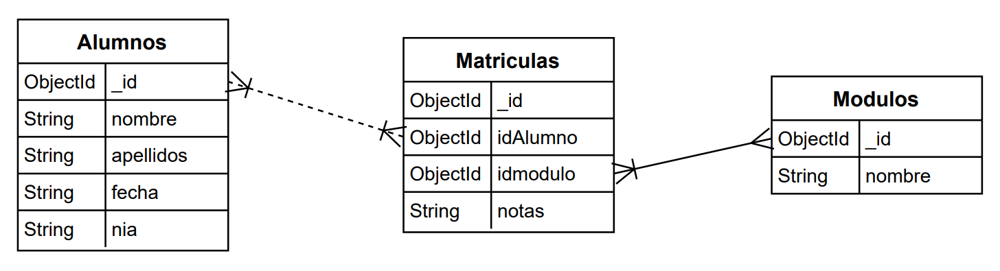

# TODO
## Alumnos
- [x] Crear alumno
  - [x] Comprobar que el nia no existe
  - [x] Insetar alumno
- [-] Eliminar Alumno
  - [-] Eliminar matriculas
  - [-] eliminar alumno
  - [x] si no existe el alumno decir que el alumnno no existia
- [x] Mostrar Alumnos
- [-] Modificar
  - [-] Nombre
  - [-] Apellidos
  - [-] NIA
  - [-] FechaNacimiento
## Modulos
- [-] Crear modulos
  - [-] Comprobar que el modulo no existe
  - [-] Insertar Modulo
- [-] Eliminar modulos
  - [-] Eliminar matriculas
  - [-] eliminar modulo
- [-] Mostrar Modulos
- [-] Modificar
  - [-] Nombre
## Matriculas
- [x] Matricular Alumno
- [-] Desmatricular Alumno
- [-] Modificar y añadir Notas alumno
- [-] Mostrar Nota de un Alumno de un modulo
- [-] Mostrar Notas de un Alumno
- [-] Mostrar Notas de el Centro
## General
- [ ] Exportar
- [ ] Importar
  - [ ] Gestionar duplicados
He cambiado el metodo getID
Mirar lo de codigo repetido en pedirNombre/pedirNia
gESTIONAR QUE LAS TABLAS EXISTAN
Gestionar que el servidor no este conectado
Gestionar que el servidor no este conectado quando ja se ha iniciado el programa, hacer en cada funcion.
## Cosas Raras
