# Examen Angles 4/12/23
- [Examen Angles 4/12/23](#examen-angles-41223)
  - [Tema 1](#tema-1)
    - [PRESENT SIMPLE](#present-simple)
    - [PRESENT CONTINUOUS](#present-continuous)
    - [PRESENT SIMPLE / PRESENT CONTINUOUS](#present-simple--present-continuous)
    - [STATIVE VERBS](#stative-verbs)
    - [IMPERATIVES](#imperatives)
    - [GERUNDS AND INFINITIVES](#gerunds-and-infinitives)
    - [WOULD + LIKE / LOVE / ENJOY / HATE](#would--like--love--enjoy--hate)
  - [Tema 2](#tema-2)
    - [Comparative Adjectives](#comparative-adjectives)
    - [Superlative Adjectives](#superlative-adjectives)
    - [TOO / ENOUGH](#too--enough)
    - [AS...AS / THE SAME AS](#asas--the-same-as)
    - [SIMILAR TO / LIKE / DIFFERENT FROM](#similar-to--like--different-from)

## Tema 1
### PRESENT SIMPLE
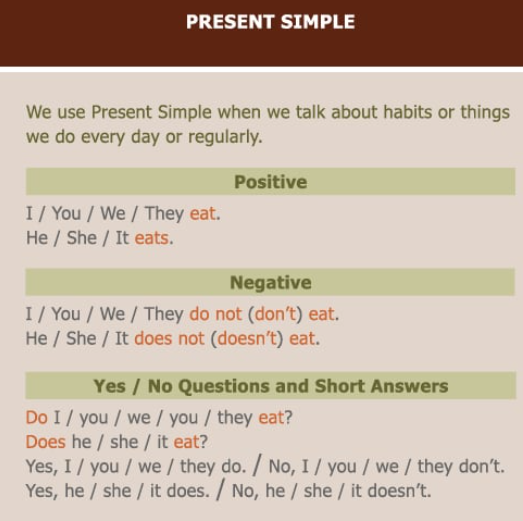

### PRESENT CONTINUOUS
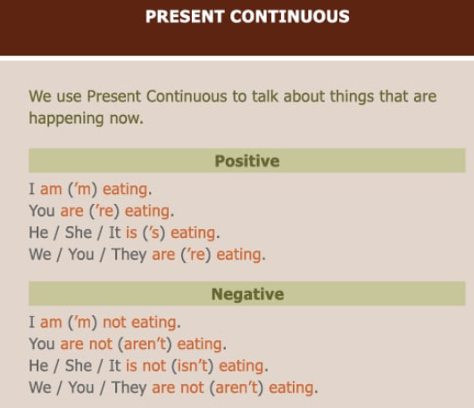
### PRESENT SIMPLE / PRESENT CONTINUOUS
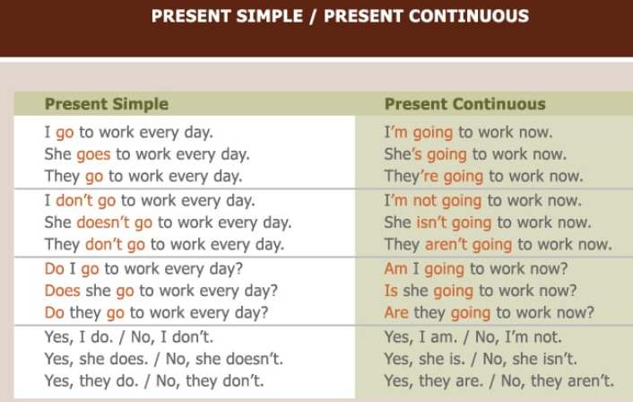

### STATIVE VERBS
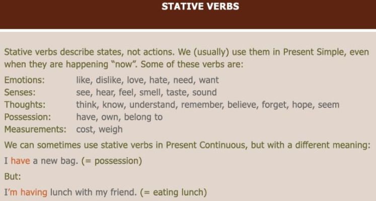
### IMPERATIVES
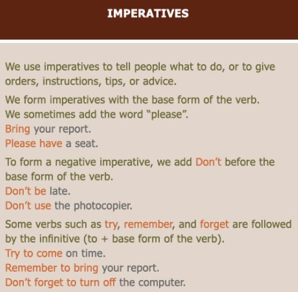

### GERUNDS AND INFINITIVES
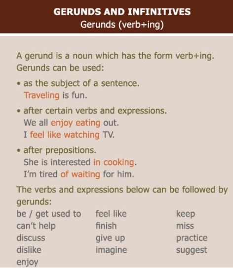

### WOULD + LIKE / LOVE / ENJOY / HATE
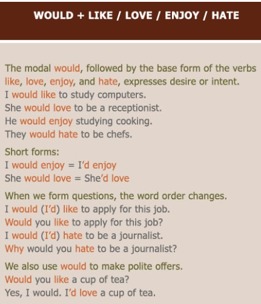

## Tema 2
### Comparative Adjectives
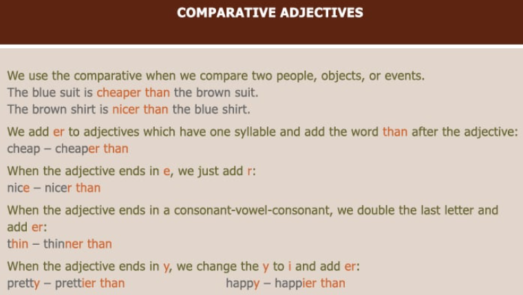
### Superlative Adjectives
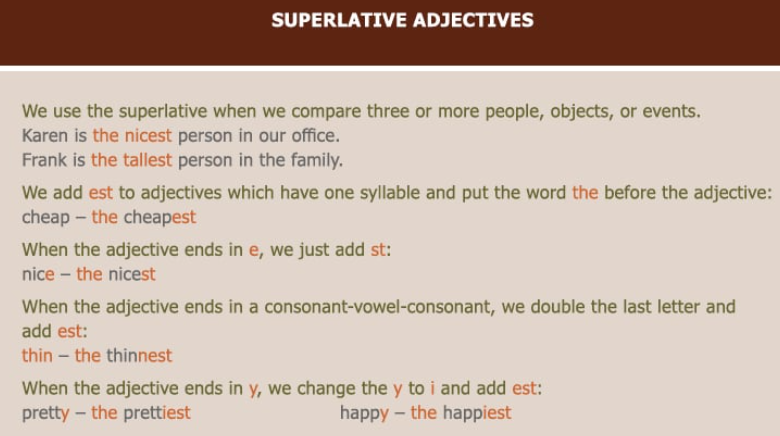
### TOO / ENOUGH
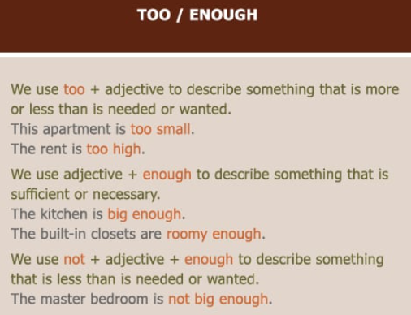

### AS...AS / THE SAME AS
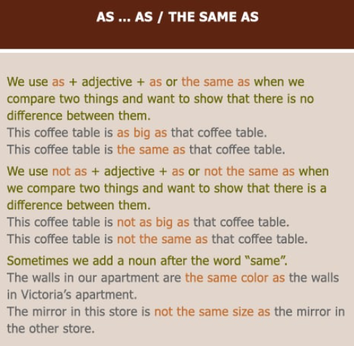
### SIMILAR TO / LIKE / DIFFERENT FROM
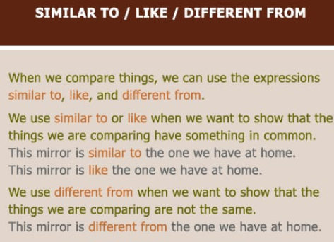
