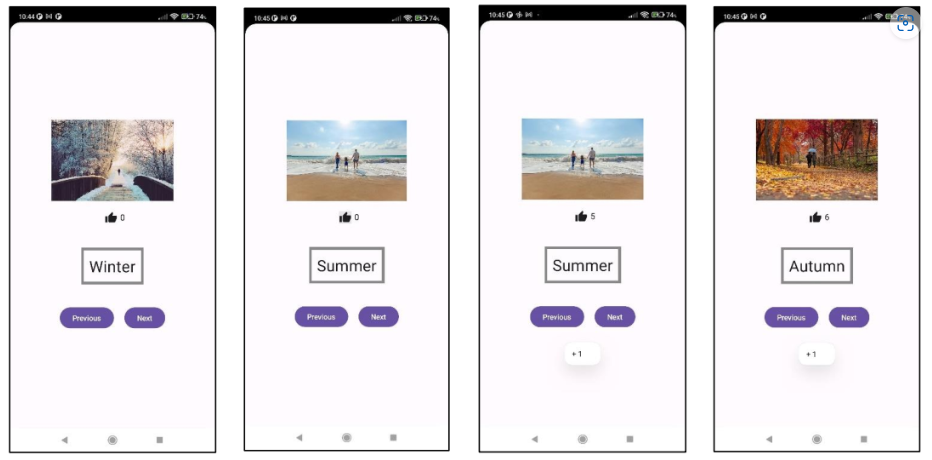

# Apuntes y TODOs Ordinaria
Per al examen de la ordinaria soles he de fer Kotlin y Android Studio
## Examen Android Studio
El examen anava de fer una app que cuan li dones a els bottons ``Next`` i ``Previous`` lo que fan es pasar a la image seguent de les estacions de l'any, ademés hi ha un contador de likes que quan li dones augmenta els likes i apareix un ``Toast`` que fica "+1".
Crear una clase ``Data`` para almacenar los datos como el texto y los likes y las imaguenes.
Ha de quedar com en la imatge:  

  
Les imatge de les estacions són:  
[./spring.jpg](./spring.jpg)  
[./winter.jpg](./winter.jpg)  
[./autumn.jpg](./autumn.jpg)  
[./summer.jpg](./summer.jpg)  
## TODO
- [ ] Curs de Android Studio
- [ ] Curs basic de Kotlin 
