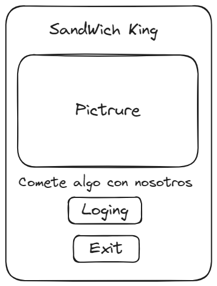
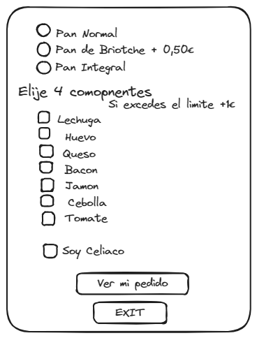
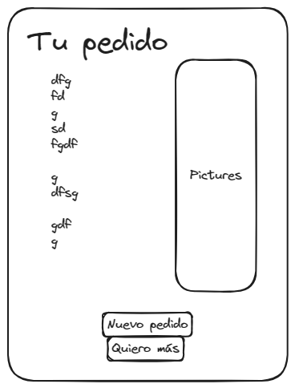
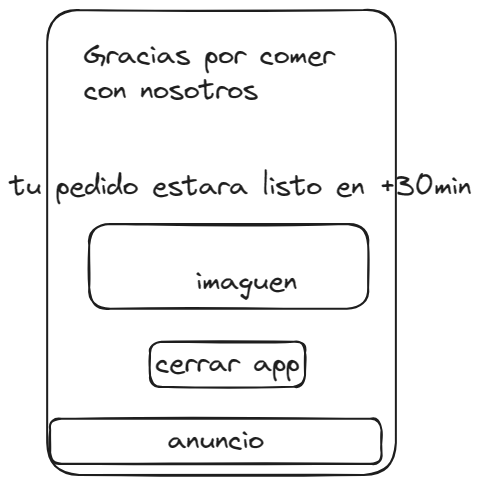

## Loging

la idea es que si presionas en la imaguen la imaguen cambia

## Pedido

Añadir para comer en restaurante o para llevar
Estaria be que ficara, tu pedido estara listo en h mas 30 min
## Resumen

## Exit

# TODO
1. [x] Strings
1. [x] Diseñar las ventanas
2. [x] Asignar funciones a los botones
3. [x] Que puedan compartir información
4. [x] Comprobar los Strings harkodeados
5. [x] content description
6. [x] Comprobar Colores harkodeados
7. [x] Scafold
8. [x] Dialog
9. [x] snackbar
10. [x] Form components
11. [x] icons
12. [x] background
13. [x] meter un espacio por el scaffold
14. [x] si no seleccionas nada el programa peta