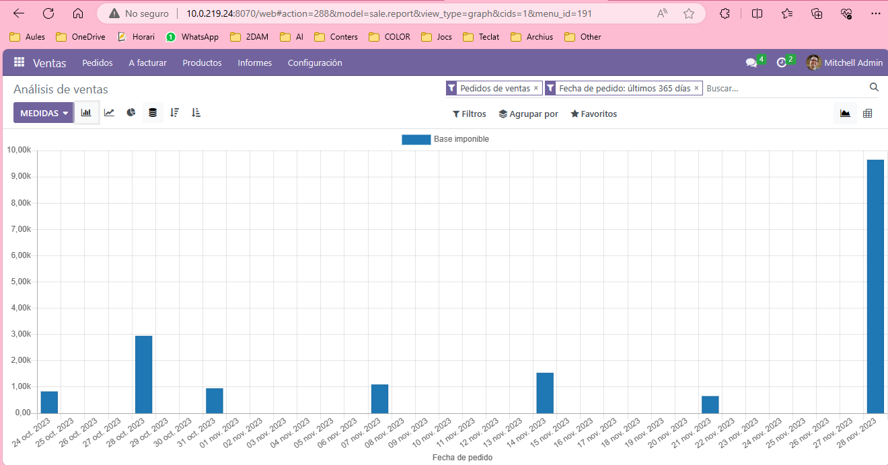

# Analisis de la tabla

En esta tabla podemos ver los dias que se han vendido productos y una aprozimación de la cantidad de dinero ganado, vemos tambíen que el mes de noviembre hemos obtenido una mayor cantidad de ingresos.

Podemos observar que en la empresa, no tenemos ventas todos los dias, pero si una cantidad de ventas elevada varios dias al més. Tambén vemos que nuestra última compra de nuestro comercial ha sido bastante elevada ya que puede que se este preparando para navidad, me sorprende que no tengamos ninguna compra elevada antes de el Black Friday, puede que esto se deba a la mala gestion de nuestro comercial o incluso por los tiempos de crisis que suponen para la mayor parte de los clientes de nuestro comercial. 

Esperemos que este mes de Diciembre tengamos una mayor cantidad de ventas ya que en los tiempos de Navidad suele incrementar bastante las compras por regalos o incluso por la 

## TODO
- [x] Tria un gràfic que vulgues i fes un anàlisi del mateix. (Adjunta'l a la tasca)
- [ ] Indica a més, com creus que va la empresa en aquest mateix instant.
- [ ] Com creus que evolucionarà al mes següent?
- [ ] Eres un cap de departament de vendes, quins quatre consells li donaries per tal de millorar l'empresa?

