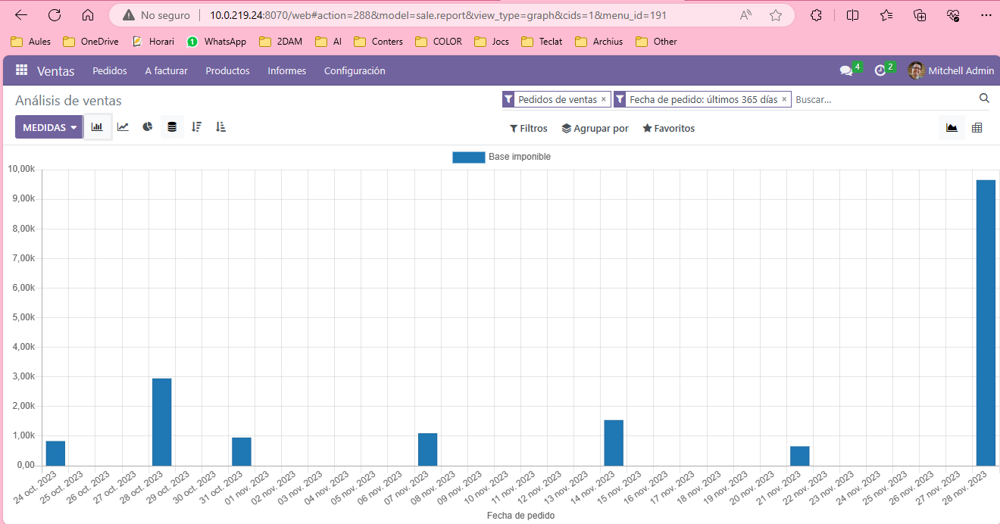

# Avaluació del gràfic de vendes
## Tria un gràfic que vulgues i fes un anàlisi del mateix. (Adjunta'l a la tasca)

En aquesta taula, es detallen els dies de venta de productes amb una aproximació dels ingressos obtinguts. S'observa que en novembre s'han registrat ingressos més elevats.

## Indica a més, com creus que va la empresa en aquest mateix instant.
Es nota que l'empresa no registra ventes diàries, però sí uns dies amb ventes significatives al mes. La última compra del nostre comercial ha segut considerablement elevada, possiblement preparant-se per a la temporada de Nadal. Resulta sorprenent la falta de compres abans del Black Friday, potser a causa d'una mala gestió del comercial o també per la crisi del país que afecta molts dels nostres clients.

## Com creus que evolucionarà al mes següent?
Espere veure un augment significatiu de les ventes aquest desembre, ja que durant les festes nadalenques solen incrementar les compres per a regals i pel bon humor general. Amb un esforç i una publicitat adequada, podrem posicionar la nostra empresa al top després de les festes.

## Ets cap de departament de vendes, quins quatre consells li donaries per tal de millorar l'empresa?

### Entendre el Mercat i els Clients:
Realitza una investigació exhaustiva per comprendre les necessitats dels clients, les tendències del mercat i la competència.

### Formació Continua:
Implementa programes de formació per mantenir l'equip de vendes actualitzat amb les últimes tècniques i coneixements.

### Establir Objectius Clars i Mesurables:
Defineix objectius específics i assolibles per mantenir l'equip enfocat i motivat. Un equip amb objectius millora el rendiment mitjançant una millor organització.

### Cuidar el Benestar de l'Equip
Prioritza el benestar dels membres de l'equip, ja que un personal satisfet i motivat té un impacte positiu en la seva productivitat i rendiment de ventes.

## TODO
- [x] Tria un gràfic que vulgues i fes un anàlisi del mateix. (Adjunta'l a la tasca)
- [x] Indica a més, com creus que va la empresa en aquest mateix instant.
- [x] Com creus que evolucionarà al mes següent?
- [x] Eres un cap de departament de vendes, quins quatre consells li donaries per tal de millorar l'empresa?
- [x] Millorar el text en GPT
- [x] Traduir el text
- [ ] Fer Word

