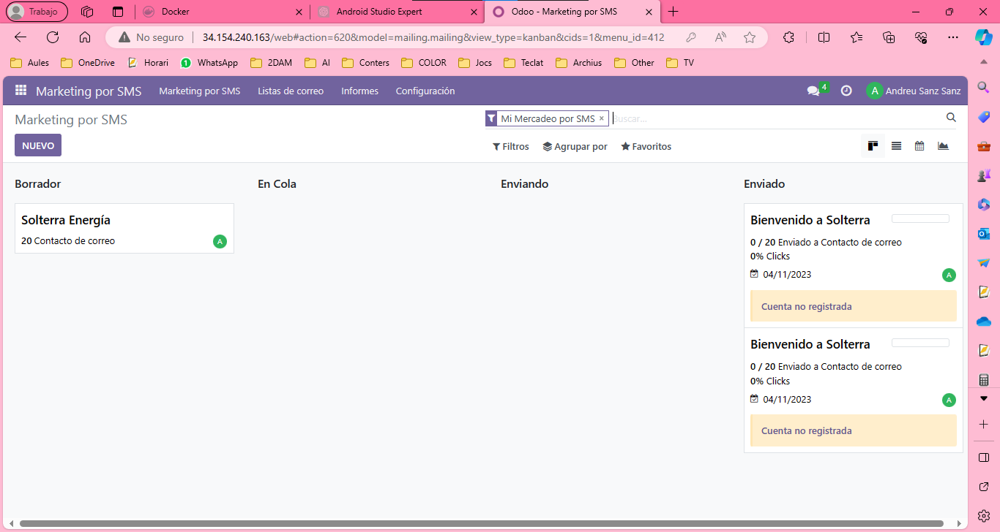
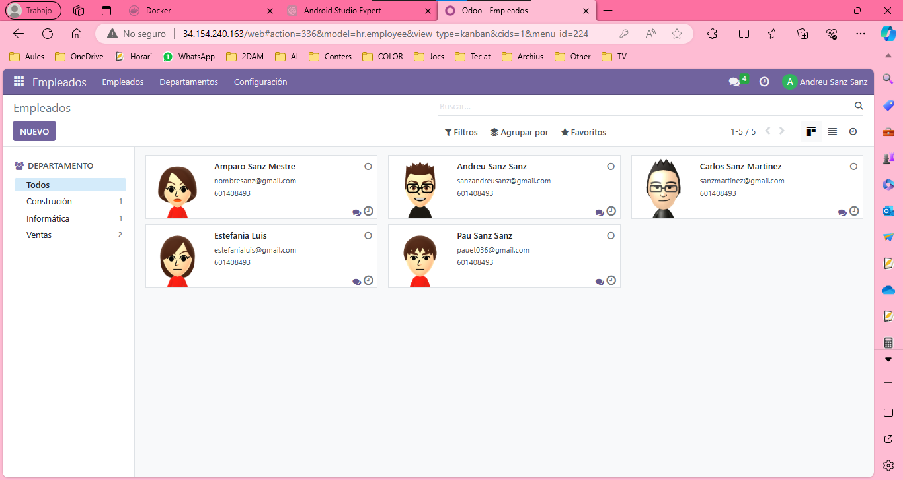

# FASES IMPLANTACIÓN ERP E IDENTIFICACIÓN PARTES MVC
- [FASES IMPLANTACIÓN ERP E IDENTIFICACIÓN PARTES MVC](#fases-implantación-erp-e-identificación-partes-mvc)
  - [Ejercicio 1. A partir de las fases de implantación de un ERP, se pide que a partir del proyecto Odoo que realizasteis en su día, las redactéis.](#ejercicio-1-a-partir-de-las-fases-de-implantación-de-un-erp-se-pide-que-a-partir-del-proyecto-odoo-que-realizasteis-en-su-día-las-redactéis)
    - [Iniciación](#iniciación)
      - [Estudiar el ámbito del proyecto](#estudiar-el-ámbito-del-proyecto)
      - [Realizar estudio de viabilidad económica, técnica y organizativa](#realizar-estudio-de-viabilidad-económica-técnica-y-organizativa)
      - [Determinar nivel de cambio a un nuevo sistema](#determinar-nivel-de-cambio-a-un-nuevo-sistema)
      - [Organizar el proyecto y planificarlo](#organizar-el-proyecto-y-planificarlo)
    - [Desarrollo](#desarrollo)
      - [Análisis detallado](#análisis-detallado)
      - [Diseño físico del sistema](#diseño-físico-del-sistema)
      - [Diseño lógico del sistema](#diseño-lógico-del-sistema)
      - [Revisión de previsiones](#revisión-de-previsiones)
    - [Implementación](#implementación)
      - [Adquisición del hardware](#adquisición-del-hardware)
      - [Desarrollo de software](#desarrollo-de-software)
      - [Plan de pruebas](#plan-de-pruebas)
      - [Documentación](#documentación)
    - [Implantación](#implantación)
      - [Plan de implantación](#plan-de-implantación)
      - [Implantación](#implantación-1)
      - [Formación](#formación)
      - [Conversión y migración de datos](#conversión-y-migración-de-datos)
      - [Test de aceptación](#test-de-aceptación)
    - [Producción y Soporte](#producción-y-soporte)
      - [Operación normal](#operación-normal)
      - [Soporte](#soporte)
      - [Mantenimiento](#mantenimiento)
      - [Documentación al cliente](#documentación-al-cliente)
  - [Ejercicio 2. ¿En qué tipo de modelo se basa un ERP para conseguir independencia entre lo que ve el usuario y los datos? Realiza un esquema del mismo.](#ejercicio-2-en-qué-tipo-de-modelo-se-basa-un-erp-para-conseguir-independencia-entre-lo-que-ve-el-usuario-y-los-datos-realiza-un-esquema-del-mismo)
  - [Ejercicio 3. Identifica a partir de tu proyecto las vistas que tienes (por módulos). Realiza capturas.](#ejercicio-3-identifica-a-partir-de-tu-proyecto-las-vistas-que-tienes-por-módulos-realiza-capturas)
  - [Ejercicio 4. Identifica a partir de tu proyecto los modelos (por tabla en la base de datos general).](#ejercicio-4-identifica-a-partir-de-tu-proyecto-los-modelos-por-tabla-en-la-base-de-datos-general)

## Ejercicio 1. A partir de las fases de implantación de un ERP, se pide que a partir del proyecto Odoo que realizasteis en su día, las redactéis.

### Iniciación

#### Estudiar el ámbito del proyecto

- Nos hemos reunido con los diferentes gerentes de cada departamento para organizarnos y redactar el protocolo para el montaje y la fabricación de cada producto, además de las pruebas preventa.
- Redactamos las mejores formas para llevar a cabo una instalación solar y cómo mejorar el rendimiento de la empresa.

#### Realizar estudio de viabilidad económica, técnica y organizativa

- Hemos buscado la manera más económica para conseguir los materiales necesarios para la instalación, soportes, herramientas, etc.
- Analizamos exhaustivamente qué módulos serían necesarios para la implementación de Odoo en Solterra.
- Redactamos unos protocolos a seguir para tener una organización para la venta de productos y el montaje de ellos.

#### Determinar nivel de cambio a un nuevo sistema

- Pensamos en los posibles cambios para la empresa al adoptar un ERP como Odoo y de qué manera podemos adaptarnos mejor y reorganizar el equipo para ello.

#### Organizar el proyecto y planificarlo

- Redactamos un conjunto de herramientas y recursos que nos serían útiles en la empresa.

### Desarrollo

#### Análisis detallado

Redactamos cómo y dónde realizar el montaje de nuestra instalación del ERP junto con otros posibles programas que nos harán falta en un futuro. Por esa razón, decidimos tener unos componentes suficientemente potentes.

#### Diseño físico del sistema

Redactamos sobre papel un boceto de dónde podríamos poner nuestro servidor para Odoo y adaptar el entorno para el servidor por temas de la mejor temperatura en verano, polvo, etc., para prevenir el mantenimiento del servidor.

#### Diseño lógico del sistema

Redactamos un diseño de la red en la empresa, qué IPs se pueden conectar, y dónde se sitúa esa IP haciendo referencia al dispositivo.

#### Revisión de previsiones

Por último, comprobamos que todo esté correcto y que no tengamos ningún posible fallo en el diseño que luego nos pueda complicar mucho el trabajo.

### Implementación

#### Adquisición del hardware

Compramos el hardware necesario para llevar a cabo el proyecto; no fue mucho ya que la mayoría ya disponíamos de él.

#### Desarrollo de software

Instalamos Odoo en el servidor y lo configuramos según las necesidades de la empresa.

#### Plan de pruebas

Realizamos entornos de prueba para poder testear los cambios en el servidor o en el ERP sin necesidad de sufrir las consecuencias si se produjera un error en el proceso.

#### Documentación

Redactamos todo lo realizado para en un futuro saber todo lo que hemos hecho además de poder compartir esta información con nuevos empleados de la empresa.

### Implantación

#### Plan de implantación

#### Implantación

Estamos ejecutando meticulosamente nuestro plan de implantación para garantizar la continuidad del negocio durante la transición. Durante esta fase, estamos concentrados en la personalización para satisfacer las necesidades específicas de nuestro negocio.

#### Formación

Estamos proporcionando una capacitación integral a nuestros empleados, asegurándonos de que estén familiarizados con los nuevos procesos y capacitados para manejar solicitudes personalizadas para un mejor trabajo en el futuro.

#### Conversión y migración de datos

Hemos llevado a cabo una migración efectiva de datos históricos hacia Odoo, asegurando la integridad de la información relacionada con productos personalizados.

#### Test de aceptación

Cualquier problema identificado durante estas pruebas está siendo abordado de inmediato, con un enfoque especial en aquellos relacionados con la personalización.

### Producción y Soporte

#### Operación normal

Hemos logrado una transición completa hacia la operación normal con Odoo.

#### Soporte

Tenemos un soporte continuo para resolver cualquier problema con Odoo en nuestros empleados.

#### Mantenimiento

Llevamos a cabo una evaluación constante en busca de posibles mejoras en el ERP y la empresa. Aplicamos regularmente actualizaciones y parches de Odoo, garantizando la compatibilidad con las últimas funcionalidades de personalización.

#### Documentación al cliente

Entrega de documentación actualizada al cliente, destacando los aspectos específicos para el mantenimiento rutinario de su instalación.

## Ejercicio 2. ¿En qué tipo de modelo se basa un ERP para conseguir independencia entre lo que ve el usuario y los datos? Realiza un esquema del mismo.

## Ejercicio 3. Identifica a partir de tu proyecto las vistas que tienes (por módulos). Realiza capturas.

Contactos:

Compra:

Ventas:

Facturación:

Sitio web:

Marketing email:

SMS:

Encuesta:

Inventario:

Empleados:

## Ejercicio 4. Identifica a partir de tu proyecto los modelos (por tabla en la base de datos general).

He entrado en modo desarrollador de Odoo para poder ver los campos y poniendo el ratón encima de un campo podemos ver lo mostrado en las imágenes.

