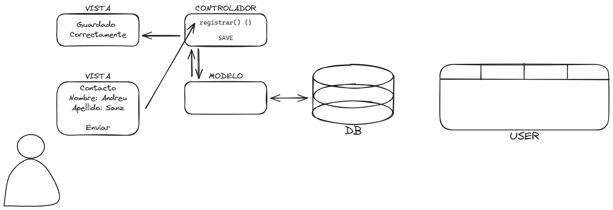

# FASES IMPLANTACIÓN ERP E IDENTIFICACIÓN PARTES MVC
## Ejercicio 1. A partir de las fases de implantación de un ERP, se pide que a partir del proyecto Odoo que realizasteis en su día, las redactéis. 
### Iniciación
#### Estudiar el ámbito del proyecto
- Nos hemos reunido con los diferentes gerentes de cada departamento para organizar-nos i redactar el protocolo para el montaje y la fabricacion de cada productos ademas de las pruebas preventa
- Redactamos las mejores formas para llevar a cabo una instalacion solar y como mejorar el rendiumiento de la empresa
#### Realizar estudio de viabilidad económica, técnica y organizativa
- Hemos buscado la manera mas economica para conseguir los materiales necesarios para la instalacion, soportes, herramientas etc.
- Analizamos ejaustivamente que modulos serian necesarios para la implementacion de Odoo en Solterra
- Redactamos unos protocolos a seguir para tener una organizacion para la venta de productos y el montaje de ellos
#### Determinar nivel de cambio a un nuevo sistema
- Pensamos en los posibles cambios para la empresa adoptar un ERP como Odoo y de que manera podernos adaptar mejor i reorganizar el equipo para ello
#### Organizar el proyecto y planificarlo
- Redactamos un conjunto herraminetas y recursos que nos serian útiles en la empresa 

### Desarrollo
#### Análisis detallado
Redactamos como y donde realizar el montaje de nuestra instalación de el ERP junto con otros posibles programas que nos aran falta en un futuro, por esa razon decidimos tener unos componentes suficintemente potentes.
#### Diseño físico del sistema
Redactamos sobre papel un bozeto de donde podiamos poner nuestro servidor para Odoo y adaptar el entorno para el servidor por temas de la mejor temperatura en verano polvo etc, para prevenir el mantenimiento de el servidor
#### Diseño lógico del sistema
Redactamos un diseño de la red en la empresa, que ips se pueden conectar, donde se situa esa ip haciendo referencia al dispositivo.
#### Revisión de previsiones
Por último comprobamos que todo estre correcto y que no tingamos ningún posible fallo en el diseño que luego nos pueda complicar mucho el trabajo
### Implementación
#### Adquisición del hardware
Compramos el HW necesario para llevar a cabo el proyecto, no fue mucho ya que la mayoria ya disponiamos de el. 
#### Desarrollo de software
Instalamos Odoo en el servidor y lo configramos segun los necesidades de la empresa
#### Plan de pruebas
Realizamos entornos de prueba para poder testear los cambios en el servidor o en el ERP sin necesidad de sufrir las consecuencias si se produjera un error en el proceso
#### Documentación
Redactamos todo lo realizado para en un futuro saber todo lo que hemos hecho ademas de poder compartir esta información con nuevos empleados de la empresa

### Implantación
#### Plan de implantación

#### Implantación
Estamos ejecutando meticulosamente nuestro plan de implantación para garantizar la continuidad del negocio durante la transición.
Durante esta fase, estamos concentrados en la personalización para satisfacer las necesidades específicas de nuestro negocio.
#### Formación
Estamos proporcionando una capacitación integral a nuestros empleados, asegurándonos de que estén familiarizados con los nuevos procesos y capacitados para manejar solicitudes personalizadas para un mejor trabajo en el futuro.
#### Conversión y migración de datos
Hemos llevado a cabo una migración efectiva de datos históricos hacia Odoo, asegurando la integridad de la información relacionada con productos personalizados.
#### Test de aceptación
Cualquier problema identificado durante estas pruebas está siendo abordado de inmediato, con un enfoque especial en aquellos relacionados con la personalización.
### Producción y Soporte
#### Operación normal
Hemos logrado una transición completa hacia la operación normal con Odoo
#### Soporte
Tenemos un soporte continuo para resolver cualquier problema con Odoo en nuestros empleados
#### Mantenimiento
Llevamos a cabo una evaluación constante en busca de posibles mejoras en el ERP y la empresa. Aplicamos regularmente actualizaciones y parches de Odoo, garantizando la compatibilidad con las últimas funcionalidades de personalización
#### Documentación al cliente
Entrega de documentación actualizada al cliente, destacando los aspectos específicos para el mantenimiento rutinaio de su instalación

## Ejercicio 2. ¿En qué tipo de modelo se basa un ERP para conseguir independencia entre lo que ve el usuario y los datos? Realiza un esquema del mismo. 

## Ejercicio 3. Identifica a partir de tu proyecto las vistas que tienes (por módulos). Realiza capturas. 

## Ejercicio 4. Identifica a partir de tu proyecto los modelos (por tabla en la base de datos general).
