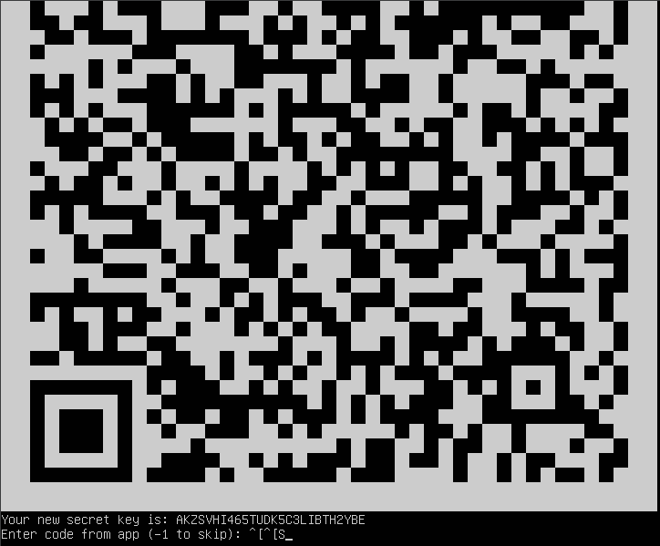
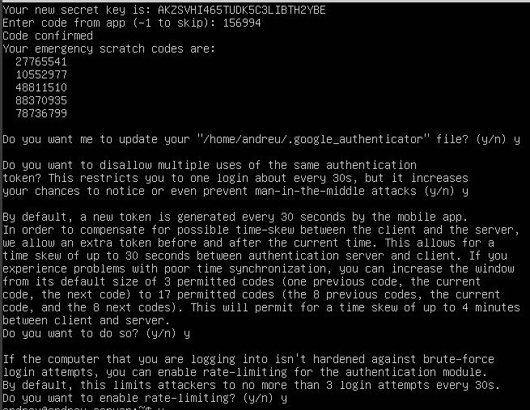
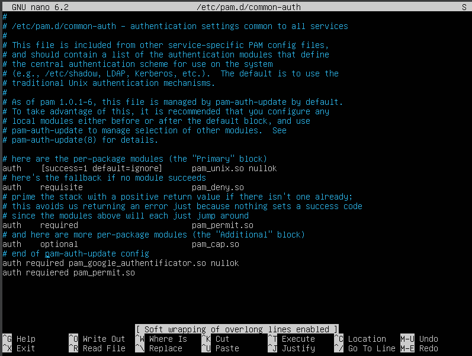
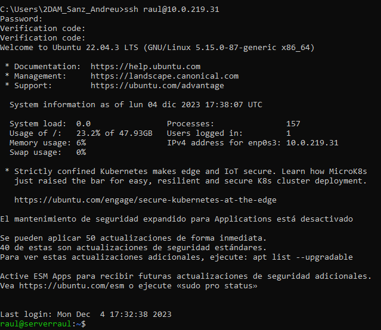

# Memoria Google Authenticator
- [Memoria Google Authenticator](#memoria-google-authenticator)
  - [Objetivo de la práctica](#objetivo-de-la-práctica)
  - [¿Qué es la autenticación de dos factores?](#qué-es-la-autenticación-de-dos-factores)
  - [Generar un QR Code](#generar-un-qr-code)
  - [Log](#log)
  - [Actvar 2FA en el Server](#actvar-2fa-en-el-server)
    - [Editar el archivo common authentification](#editar-el-archivo-common-authentification)
    - [Log en el Server](#log-en-el-server)
  - [Editar el archivo de configuación SSH para el PAM](#editar-el-archivo-de-configuación-ssh-para-el-pam)
  - [Editar el archivo de configuración del SSH](#editar-el-archivo-de-configuración-del-ssh)
  - [Reiniciamos el Server](#reiniciamos-el-server)
  - [Captura de la conecsión con SSH desde otro ordenador](#captura-de-la-conecsión-con-ssh-desde-otro-ordenador)

## Objetivo de la práctica
El objetivo de esta practica es aprender como añadir una autentificacion en dos pasos en nuestro servidor, para augmentar la seguridad en nuestro servidor. 

## ¿Qué es la autenticación de dos factores?
La autenticación de dos factores, también conocida como autenticación de dos pasos o autenticación de dos vías, es un proceso de seguridad en dos etapas en el que aseguras tus cuentas con una segunda contraseña, reduciendo así el riesgo de robo de datos. Esto significa que, si deseas iniciar sesión en tu cuenta desde un nuevo dispositivo, necesitarás un segundo código además de la contraseña que hayas elegido para confirmar el acceso.

## Generar un QR Code

## Log

## Actvar 2FA en el Server
### Editar el archivo common authentification

### Log en el Server
> Tuvimos que cambiar de Maquina virtual por problemas tecnicos

.jpeg)
## Editar el archivo de configuación SSH para el PAM
.jpeg)
## Editar el archivo de configuración del SSH
.jpeg)
## Reiniciamos el Server
.jpeg)

## Captura de la conecsión con SSH desde otro ordenador

