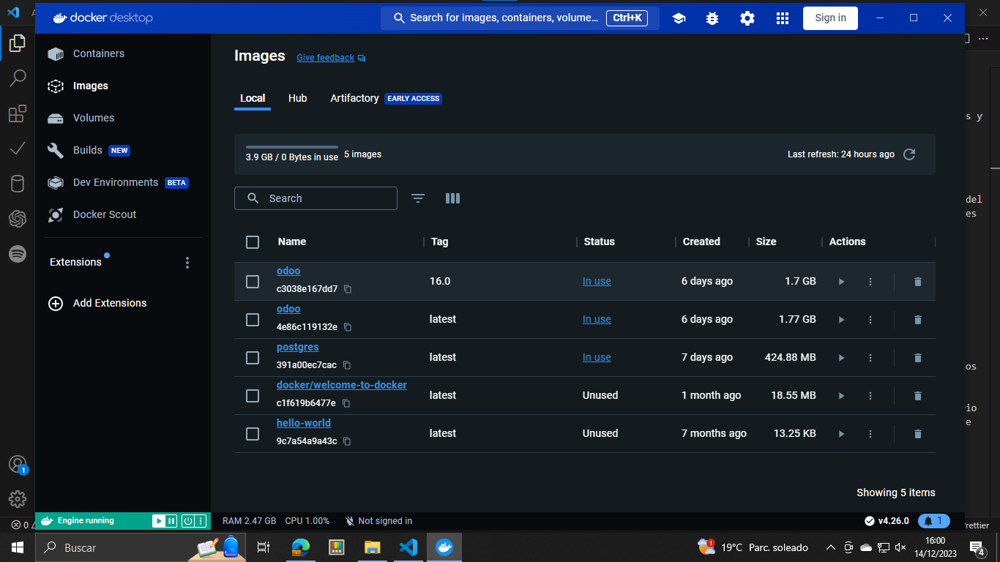
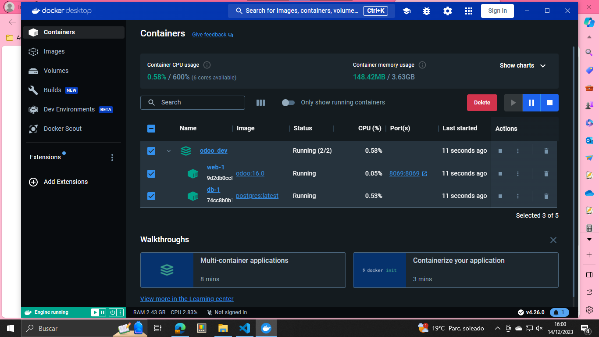
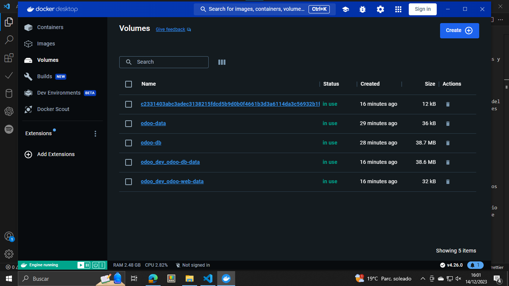
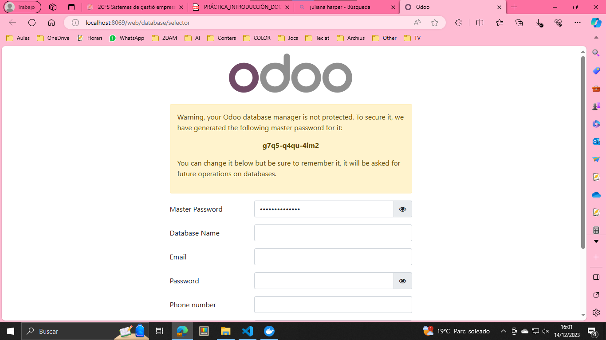

# INTRODUCCIÓN A DOCKER
Andreu Sanz Sanz | 2DAM  
Sistemes de Gestió Empresarial

- [INTRODUCCIÓN A DOCKER](#introducción-a-docker)
  - [1. Explica para que sirve lo siguiente en Docker:](#1-explica-para-que-sirve-lo-siguiente-en-docker)
  - [2. Indica para qué sirve lo anterior en nuestro proyecto odoo.](#2-indica-para-qué-sirve-lo-anterior-en-nuestro-proyecto-odoo)
  - [3. ¿Qué es Docker Compose?](#3-qué-es-docker-compose)
  - [4. ¿Docker permite borrar una imagen si existen contenedores asociados?¿Qué hay que hacer para borrar una imagen?](#4-docker-permite-borrar-una-imagen-si-existen-contenedores-asociadosqué-hay-que-hacer-para-borrar-una-imagen)
  - [5. Indica los siguientes comandos de Docker para qué sirven:](#5-indica-los-siguientes-comandos-de-docker-para-qué-sirven)
  - [6. ¿Para qué sirve el fichero docker-compose.yaml?](#6-para-qué-sirve-el-fichero-docker-composeyaml)
  - [7. Realiza captura de pantalla de qué tienes disponible el servicio Odoo en Docker.](#7-realiza-captura-de-pantalla-de-qué-tienes-disponible-el-servicio-odoo-en-docker)

## 1. Explica para que sirve lo siguiente en Docker:
### Imágenes
Representan plantillas ejecutables que contienen todo lo necesario para ejecutar una aplicación, incluyendo código, bibliotecas y configuraciones, facilitando la implementación consistente de aplicaciones en entornos diversos.

### Contenedores
Son instancias ejecutables de imágenes que encapsulan una aplicación y sus dependencias, proporcionando un entorno aislado y portable para su ejecución, con la capacidad de iniciarse, detenerse y moverse fácilmente entre diferentes entornos.
### Volúmenes
Son mecanismos para persistir y compartir datos entre contenedores y el sistema host, ofreciendo almacenamiento independiente del ciclo de vida del contenedor, lo que permite manejar datos que requieren persistencia y facilita la colaboración entre múltiples contenedores.

## 2. Indica para qué sirve lo anterior en nuestro proyecto odoo.
### Imágenes
Tengo otra imagen, la de welcome-to-docker, porque antes de empezar con el temario me informé un poco de lo que era Docker e hice algunas pruebas.  

### Contenedores

### Volúmenes

## 3. ¿Qué es Docker Compose?
Docker Compose es una herramienta que simplifica la gestión de múltiples contenedores Docker mediante la definición de servicios en un archivo YAML, facilitando el despliegue coordinado de aplicaciones.

## 4. ¿Docker permite borrar una imagen si existen contenedores asociados?¿Qué hay que hacer para borrar una imagen?
No, Docker no permite borrar una imagen si existen contenedores asociados a ella. Para eliminar una imagen, primero es necesario detener y eliminar todos los contenedores basados en esa imagen y luego proceder con la eliminación de la imagen. Esto se puede lograr usando los comandos ``docker stop``, ``docker rm`` y finalmente ``docker rmi`` o desde la docker desktop.
## 5. Indica los siguientes comandos de Docker para qué sirven:
- ``docker run mongo``:  Inicia un contenedor de MongoDB.
- ``docker pull mongo``: Descarga la imagen de MongoDB desde Docker Hub.
- ``docker images ``: Lista las imágenes de Docker en el sistema.
- ``docker run –d --name=hello-1 hello-world``: Inicia un contenedor llamado "hello-1" en segundo plano basado en la imagen "hello-world".
- ``docker run –d --restart=”always” -e POSTGRES_USER=odoo –e POSTGRES_PASSWORD=odoo –e POSTGRES_DB=postgres --name db postgres:latest``: Inicia un contenedor de PostgreSQL llamado "db" con configuraciones específicas y reinicio automático.
- ``docker run –p 8069:8069 --name odoo --link db:db –t odoo``: Inicia un contenedor de Odoo, establece redireccionamiento de puertos y vincula a un contenedor llamado "db".
- ``docker run –v odoo-data:/var/lib/odoo -v /Users/.../odoo_dev/config_odoo:/etc/odoo -d –p 8069:8069 --name odoo --link db:db –t odoo``: Inicia un contenedor de Odoo con volúmenes persistentes y configuraciones específicas.

## 6. ¿Para qué sirve el fichero docker-compose.yaml?
El archivo `docker-compose.yaml` se utiliza para declarar y configurar servicios, redes y volúmenes en entornos Docker, facilitando la definición y gestión de múltiples contenedores y sus interacciones de manera estructurada.

## 7. Realiza captura de pantalla de qué tienes disponible el servicio Odoo en Docker.

