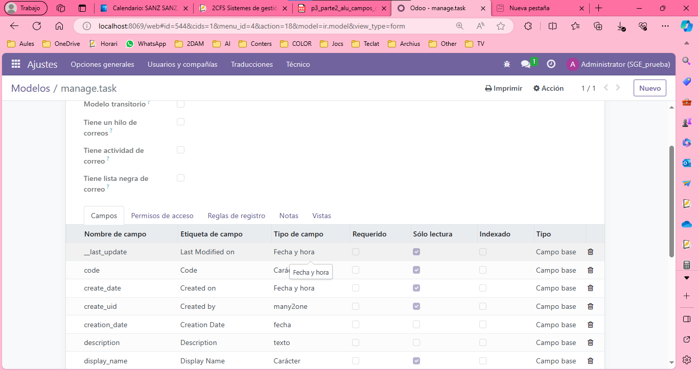
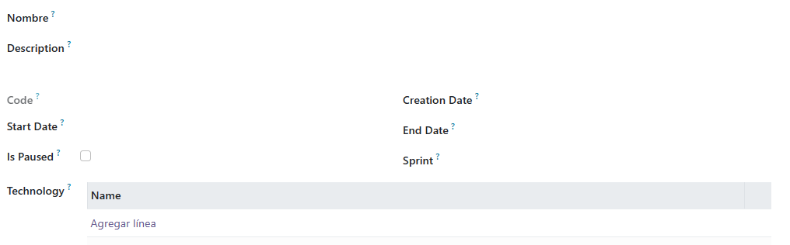

# Objetivo 1
## Realiza captura del campo nuevo creado desde Odoo, en el apartado de Ajustes Técnico >> Modelos. 


## ¿Cómo se crea una función en Python? ¿Y el bucle for? Realiza captura/s en Odoo de las pruebas realizadas para ver que la función realizada en Python es la correcta. 


Para crear una función en Python, utilizas la palabra clave def, seguida del nombre de la función, paréntesis que pueden contener parámetros (si los hay), y un bloque de código indentado que define lo que hace la función. En tu código, la función _get_code se define de la siguiente manera:

TODO: La función se crea con el atributo ``def`` y el bucle `for`
## Explica con pseudocódigo las función _get_code creada.
```
Función _get_code(self):
    Para cada tarea en self:
        Si la longitud de la tarea.sprint es igual a 0:
            Establecer tarea.code como "TSK_" seguido de la cadena convertida de tarea.id
        De lo contrario:
            Establecer tarea.code como la cadena en mayúsculas de tarea.sprint.name seguido de "_" y la cadena convertida de tarea.id

```

# Objetivo 2

## ¿Qué realiza la función isinstance?¿Y la función timedelta?
La función isinstance(obj, class_or_tuple) en Python se utiliza para determinar si un objeto (obj) es una instancia de una clase específica o de cualquiera de las clases proporcionadas en una tupla. Devuelve True si el objeto es una instancia de la clase (o clases) dada(s), y False en caso contrario.

La función timedelta es parte del módulo datetime en Python y se utiliza para representar la diferencia entre dos fechas o horas. Se puede crear un objeto timedelta especificando los días, horas, minutos, segundos, etc., de la diferencia entre dos momentos en el tiempo.

## Explica con pseudocódigo las función _get_end_date creada. 
```
Función _get_end_date(self):
    Para cada sprint en self:
        Si sprint.start_date es una instancia de datetime y sprint.duration es mayor que 0:
            sprint.end_date = sprint.start_date + timedelta días=sprint.duration
        De lo contrario:
            sprint.end_date = sprint.start_date
```

## ¿Para qué sirve @api.depends?

La anotación @api.depends se utiliza en el contexto de Odoo (un marco de desarrollo de aplicaciones empresariales en Python) para especificar las dependencias entre campos en modelos. Indica qué campos afectan al campo en el que se coloca y, por lo tanto, cuándo se debe recalcular el valor del campo dependiente. En este caso, la función _get_end_date se ejecutará cuando cambien las fechas de inicio (start_date) o la duración (duration) de un sprint.