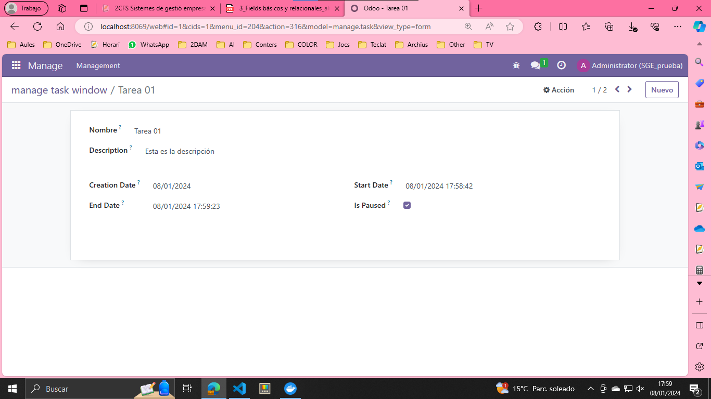
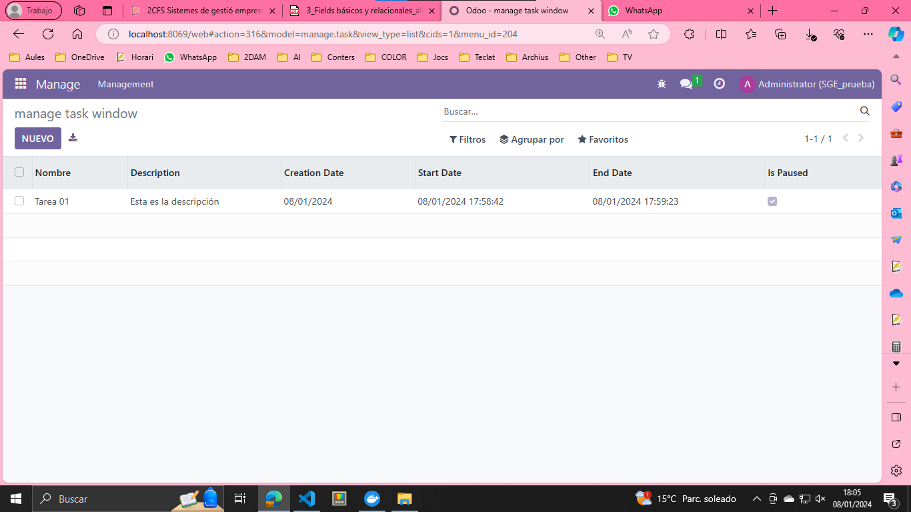
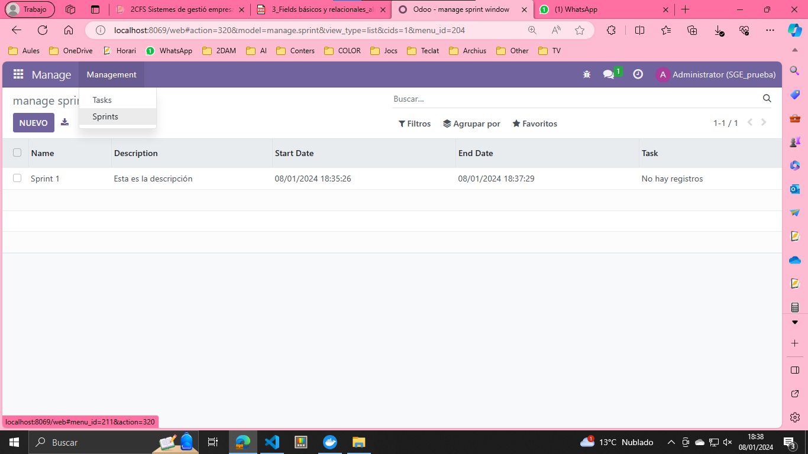
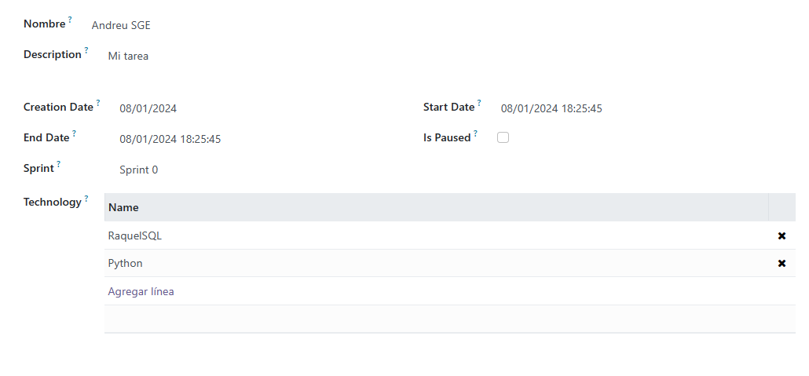

## Ejercicio 1. ¿Qué ocurre si añadimos lo siguiente al nuevo campo name? Si en vez de poner, string=”Nombre” ponemos string=”Name” ¿Qué ocurrirá?
Cambia el nombre del campo a 'Name'.

## Ejercicio 2. Si en vez de poner name, ponemos id_task ¿Qué ocurrirá?
Dará error, ya que en las vistas, la etiqueta 'field' tiene el atributo 'name' establecido como 'nombre'. Para evitar errores, deberá cambiarse a 'id_task'.

## Ejercicio 3. Realiza captura del resultado obtenido desde Odoo. 

## Ejercicio 4. Realiza captura del resultado obtenido desde Odoo

## Ejercicio 5. ¿En qué consiste la metodología SCRUM?
Scrum es una metodología de trabajo en equipo que consiste en dividir proyectos en partes pequeñas. Implica roles clave, como el Dueño del Producto y el Maestro Scrum, y se caracteriza por reuniones diarias para mantenerse actualizados. Scrum entrega partes del proyecto de manera regular y es flexible para adaptarse a cambios, lo que permite obtener resultados rápidos y de calidad.

## Ejercicio 6

## Ej 7
Ahora hemos añadido una nueva columna a la tabla llamada 'Sprint'.

## ej 8

## ej 9

## ej 10
Hemos de tener en cuenta los permisos cuando creamos una nueva clase.

Resultado final
