

## REQUISITOS PREVIOS
### 1. Comprobar que ssh está instalado (o comprobar que esté instalado)
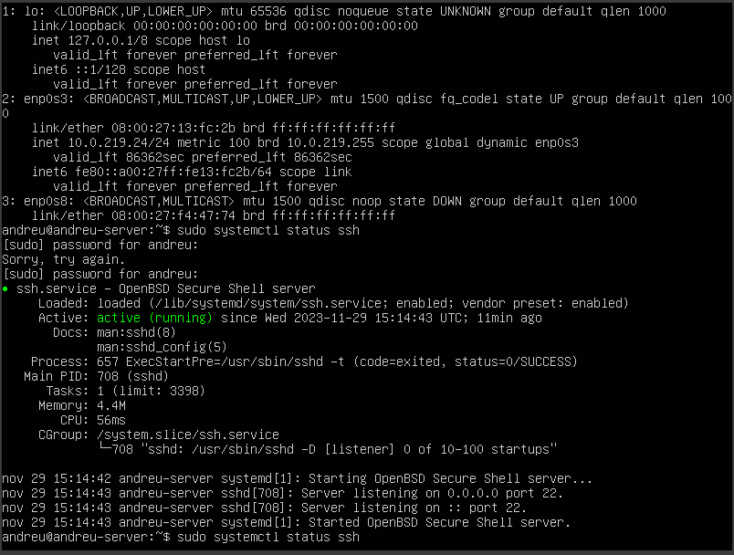

### 2. Probar la conexión a través de ssh desde WIndows a Ubuntu Server (WinSCP, Putty..)

## PREGUNTAS CONTEXTUALES FAIL2BAN
### 3. ¿Qué es un ataque de fuerza bruta?
Un ataque de fuerza bruta es un método en el que un atacante intenta descifrar una contraseña o clave mediante la prueba sistemática de todas las combinaciones posibles. Este enfoque es intensivo en recursos y lleva tiempo.
### 4. ¿Para qué sirve y qué es FAIL2BAN?
Fail2Ban es una herramienta de prevención de intrusiones en servidores GNU/Linux, escrita en Python. Se utiliza para defender contra ataques de fuerza bruta en servicios abiertos al exterior.
### 5. ¿Qué hace FAIL2BAN con el fichero de logs?
Fail2Ban monitoriza ficheros de logs, como `/var/log/auth.log`, en busca de intentos de acceso fallidos. Detecta patrones de autenticación incorrecta y toma medidas como bloquear la IP del atacante.
### 6. ¿Qué son los jails?
Los "jails" en Fail2Ban son conjuntos de reglas y acciones específicas asociadas a cada servicio que se quiere proteger. Cada jail se configura para defender un servicio particular, como sshd o apache-auth.
### 7. ¿Qué se puede hacer con FAIL2BAN?
Fail2Ban puede bloquear automáticamente las direcciones IP que superan el umbral de intentos de acceso fallidos, añadiendo reglas al cortafuegos. Aunque no es infalible, sirve como una importante primera línea de defensa contra ataques y puede trabajar en conjunto con otras medidas de seguridad.

## CONFIGURACIÓN FAIL2BAN
### 8. Instala Fail2BAN en Ubuntu Server. (CAPTURA)
comand: `sudo apt install fail2ban`  
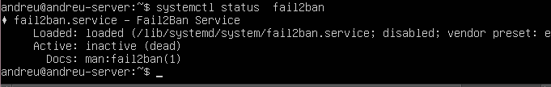

### 9. Habilita Fail2ban para que arranque automáticamente (CAPTURA)
### 10. Comprobar que el servicio fail2ban está activo (CAPTURA)
Tras ejecutar el comando `sudo systemctl enable fail2ban.service` he reiniciado el servidor con `reboot` y despues he ejecutado `sudo systemctl status fail2ban.service` para comprobar que el Fail2ban estava arrancado.  
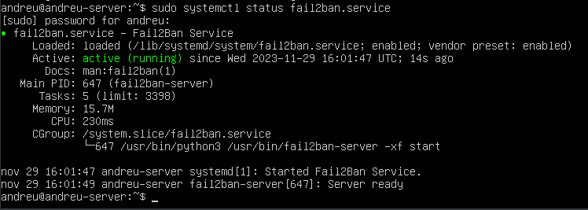

## CARACTERÍSTICAS
### 11. ¿Qué muestra sudo fail2ban-client status? ¡Explícalo! (CAPTURA)
Muestra el numero de jails que estan actualmente habilitados y el detalle de cada uno de ellos.  
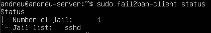

### 12. ¿Cuál es el archivo de configuración? Explica los parámetros: bantime y maxretry. (CAPTURA)
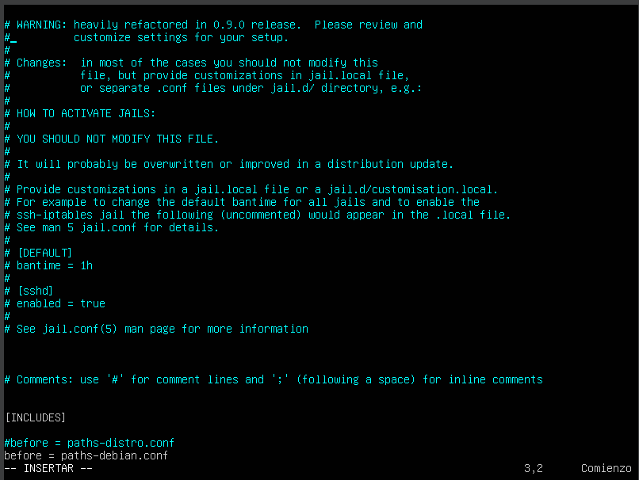
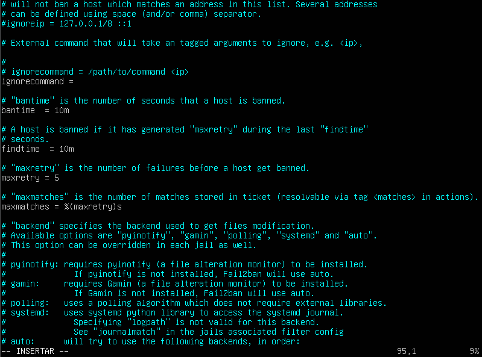

El archivo de configuración es `/etc/fail2ban/jail.conf`.
- `bantime` es el numero de segundos que el host sea baneado
- `maxretry` es la cantidad de fallos antes de que se prohíba un host.

### 13. ¿Cuál es el jail activado por defecto? (CAPTURA)
Por defecto, el unico jail que suele estar habilitado es el correspondiente al servicio sshd

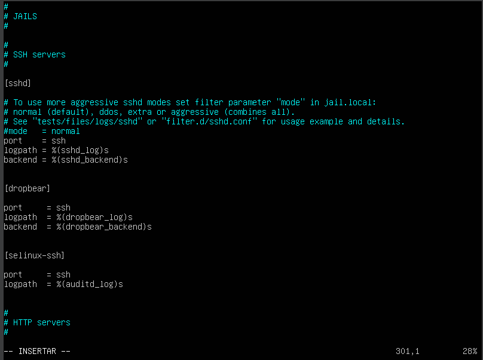
sshd
### 14. Accede al fichero de logs. (CAPTURA)
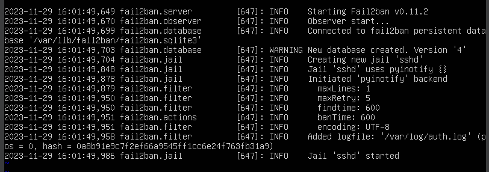

## Ejercicio 1
### Parte 1

### Parte 2
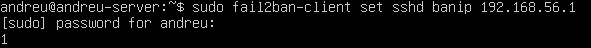
### Parte 3
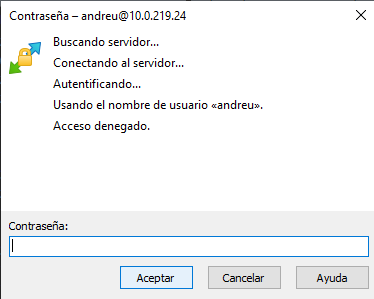
### Parte 4
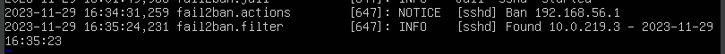
### Parte 5
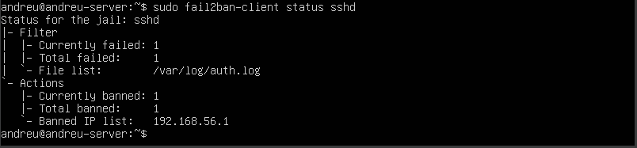
### Parte 6
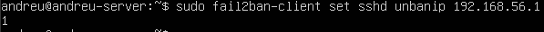

## Ejercicio 2
IP Cate: `10.0.219.14`  
IP Raquel: `10.0.219.21`

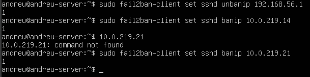

## Ejercicio 3
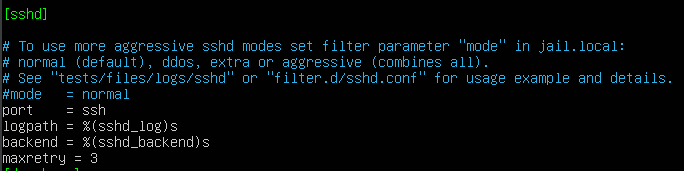
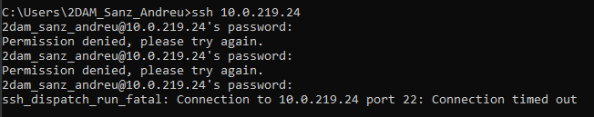

