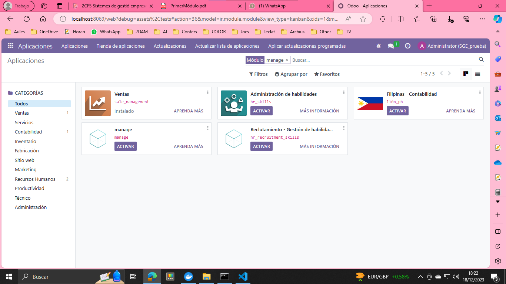
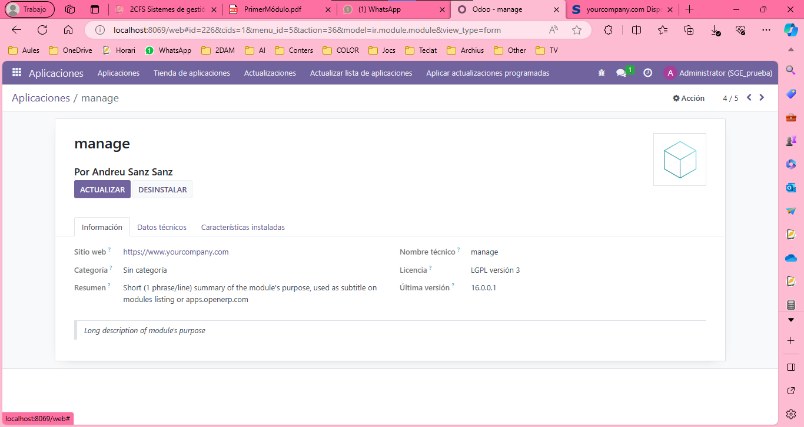
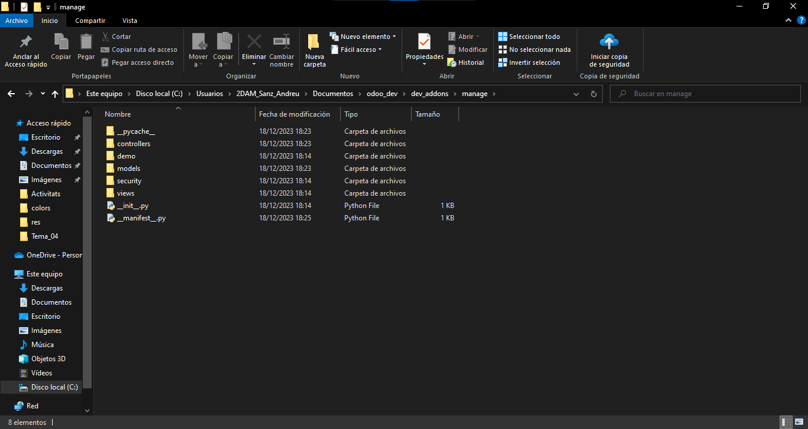
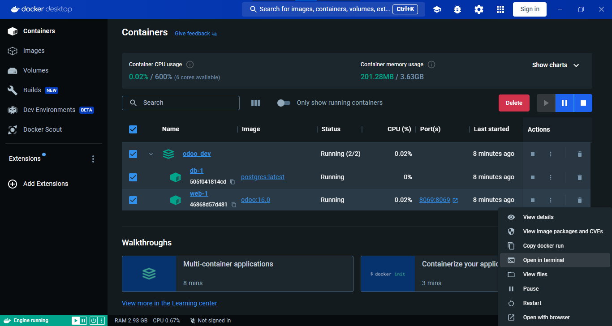
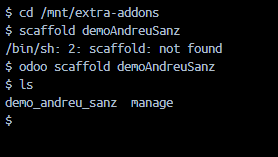
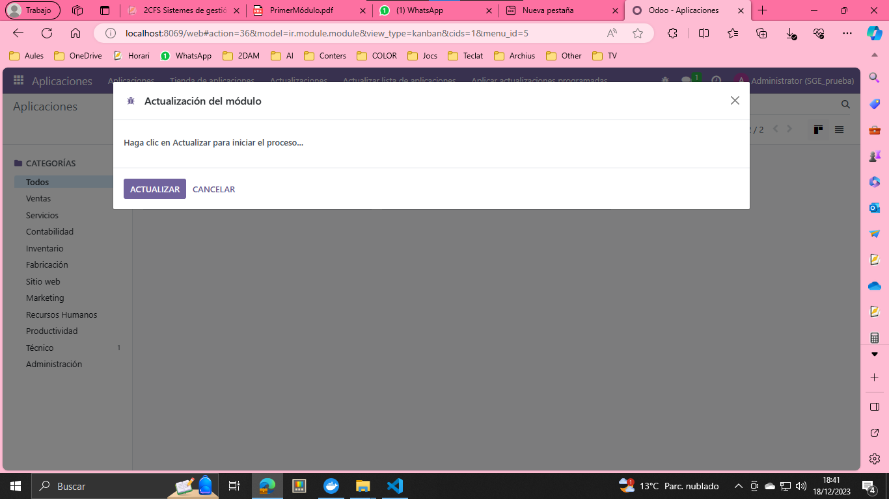
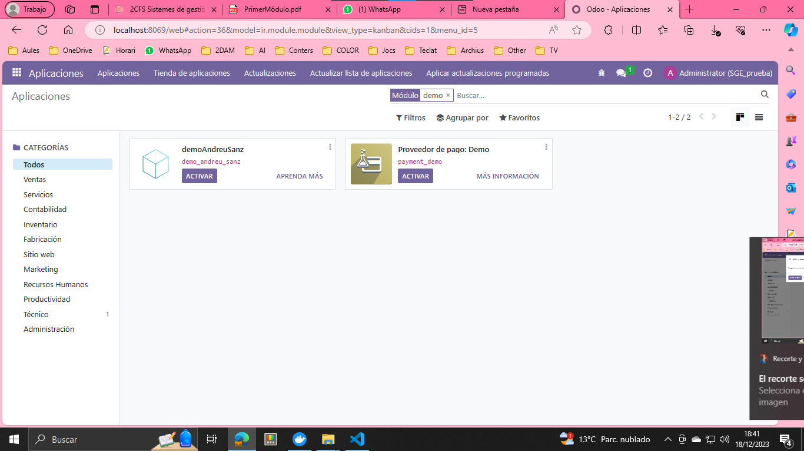

# Modulo manage y ventas

## Ejercicio 2. Cambiar de la imagen anterior “Por My Company”, por “Por TuNombre Apellido”

## Ejercicio 3. Identifica en el proyecto donde se sitúan los modelos, vistas y controladores con sus respectivos ficheros. 
 
## Ejercicio 4. Crea un módulo nuevo, llamado “demoTuNombre”, documenta todos los pasos. 
1. Abrimos la consola del docker
  
3. Ejecutamos el comando `cd /mnt/extra-addons` y `odoo scaffold demoAndreuSanz`
  

Nota: he visto que me ha cambiado el nombre a minuscula
4. Reiniciamos el docker
  
4. Reiniciamos el la lista de aplicaciones
  
5. Comprobamos que se ha creado en Odoo desde el modo desarrollador y buscamos el nombre del modulo
  
## Ejercicio 5. Sube los ejercicios anteriores a AULES con portada.