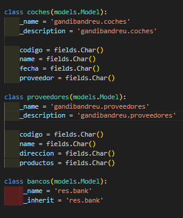
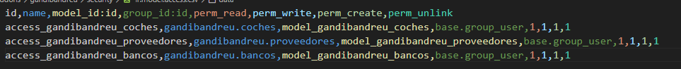
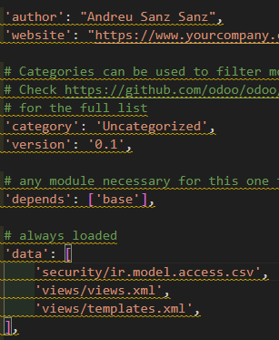
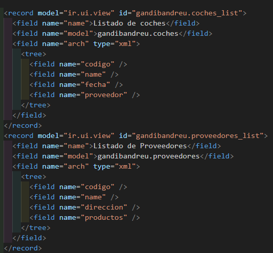
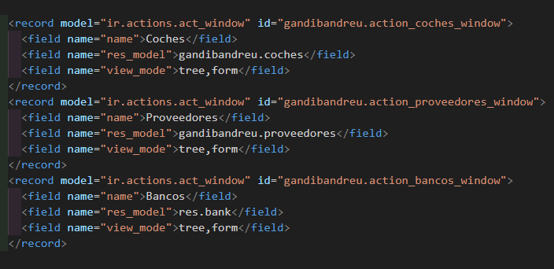
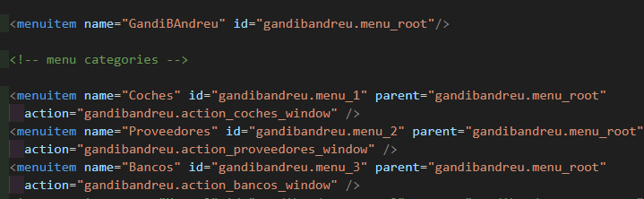
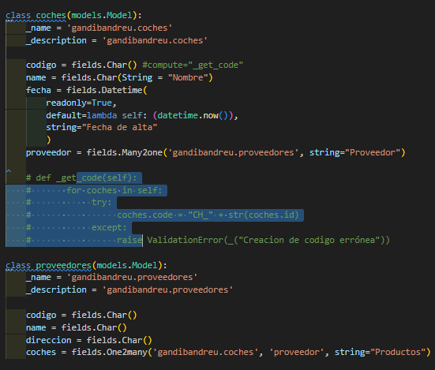
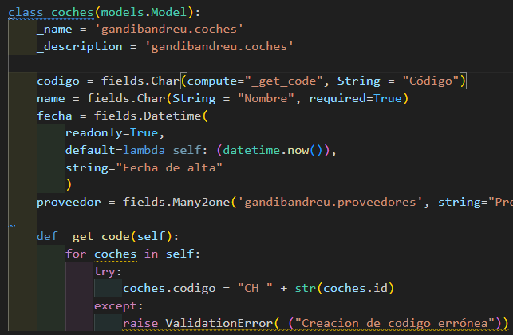
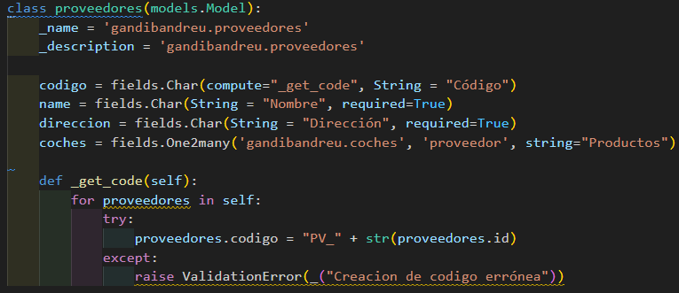

# Examen Andreu Sanz Sanz Tipo B
## Crear el modulo
Para crear el modulo devemos ejecutar en la terminal de docker `cd /mnt/extra-addons` y `odoo scaffold gandibandreu`

## Crear los modelos
Luego creamos los modelos, en mi caso he creado coches, proveedores y bancos, de momento todos los campos son char y en un futuro los modificare.

## Seguridad
Debemos añadir los modelos al fichero de seguridad además tambien debemos modificar el manifest.py para permitir la seguridad además modifico el nombre de el autor.

## Ajustar las vistas
PD: Al actualizar las vistas me he dado quenta de que el modelo campo no debe estar en el fichero de seguridad

## Configurar los modulos
Con esto ya tendiramos las relaciones:

Ahora los ids: 

Por último he cambiado el nombre de la variable name por nombre, para que se pueda ver como "Nombre" en las tablas