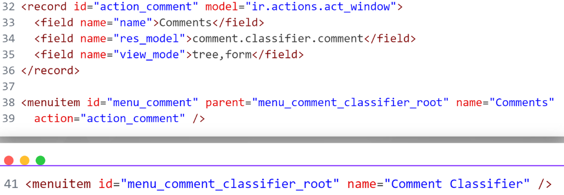

# Apunts
## Camps Personalitzats
### Còdic & Explicació
  
- Se define un registro en el modelo ir.ui.view
- Se define el nombre de la vista.
- Especificamos que esta vista está asociada con el modelo
- Indicamos que esta vista hereda de una vista existente, esto nos permite extender o modificar la vista original sin reemplazarla completamente.
- La expresión XPath selecciona un nodo específico en la vista original para insertar nuevo grupo dentro de la página de inventario
- Se define un nuevo grupo de campos y introducimos los campos

Definim un nou registre  y indiquem les dades necesaries com el nom de la vista, en este cas la vista esta asociada a,n el model de productes y extendeix d'una de les seues vistes y amb una expresio Xpath seleccionem un node especific de la vista, en aquest cas el grup inventaru dins de la seua pestaña y creem un nou grup per a els camps adicionals

## Versions Presupostos
### UML

### Explicació
- Un presupuesto puede tener muchas versiones 
### Còdic & Explicació
  
Aquesta clase ereda de sale.order. version_ids enlaza con sale.order.version y que contiene todas las versiones de una orden de venta.
Obtener datos del presupuesto actual  
  
Crear una nueva versión del presupuesto
Asociar la nueva versión con el presupuesto original  
  
Este modelo define las versiones de las órdenes de venta.  
  
El primer xptah modifica la vista original de la capçalera per a afegir un botó per a crear una nova versió
I el segon xpath modifica la vista del quadern per a introduir una nova pestaña i poder veure les versions creades.
## Comment Classification
### UML

### Explicació
**Comment:**
- Cada comentario pertenece a un único dataset (dataset_id).
- Cada comentario puede tener múltiples etiquetas (tag_ids).

**Dataset:**
- Cada dataset puede tener múltiples comentarios (comment_ids).
- Cada dataset puede tener múltiples etiquetas (tag_ids).

**Tag:**
- Cada etiqueta puede estar asociada con múltiples comentarios (comment_ids).
- Cada etiqueta pertenece a un único dataset (dataset_id).

### Còdic & Explicació
  

Definimos una nueva vista de formulario ue permite a los usuarios crear nuevos comentarios y con domain aplicamos un filtro para mostrar solo las etiquetas que pertenecen al mismo dataset  
configura una vista de lista que permite a los usuarios ver múltiples comentarios  
  
Definimos una accion para poder mostrar las dos vistas que hemos creado y creamos un submenu bajo el menú raíz que activa la accion definida.  
  
Define una vista de gráfico para analizar los comentarios clasificados.  
tag_ids se utiliza como fila   
dataset_id como columna  
  
Definim la acció i la amb el context dins del diccionary indiquem que volem agrupar els elements en dataset y etiquetes.  
  
Per últim per a poder traduir el mòdul hem de introduir dins d'un fitcher amb formati gettext el mòdul en el que ens trobem, el model y el string original y la traducció.

## Home Assistant

Definim una vista per a les Tarjetes, dins definim el tipus de tarjeta que nem a utilitzar i referenciem amb el id de l'entitat que ens proporciona les dades. Una vegada hem aconseguit totes les dades, podem persoalitzar el diseny. En aquest cas tenim com es faria una linea horitzontal.

## Conclusió
Per últim, podem concloure que amb la instal·lació del sistema de gestió empresarial, els mòduls addicionals, la VPN i la ferramenta de monitoritcació de les instalacions hem aconseguit cobrir les necessitats bàsiques d’una petita i mitjana empresa com és Solterra Energia.
A més, si ampliem altres mòduls en un futur, podrem millorar la gestiò de nostra empresa.