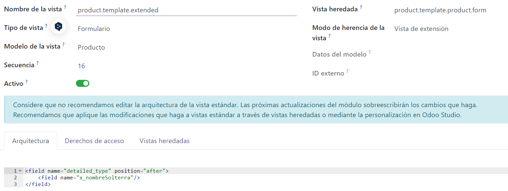

# Tutoriales
## Como añadir un campo en Odoo de forma grafica
1. Modo desarrollador > Ver campos > Nuevo -> Rellenamos
2. Modo desarrollador > Tecnico > Interfaz de usuario > Vistas > Nuevo


```
<field name="detailed_type" position="after"> //Campo de antes al que queremos poner nosotros
    <field name="x_nombreSolterra"/> // Nuestro campo
</field>
```